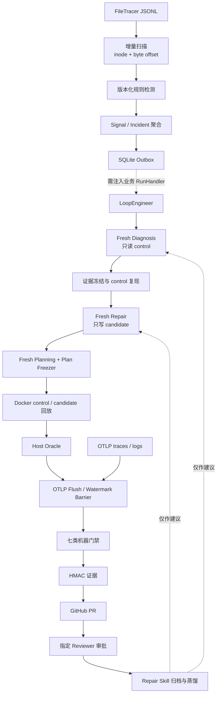

# Loop Engineer

Loop Engineer 是一个面向 Coding Agent 故障修复的本地生产仿真控制面，旨在将结构化日志发现、独立上下文诊断与修复、Git Worktree 隔离、Docker 基线/候选对照、机器门禁、GitHub Pull Request 和 Repair Skill 沉淀串联为可审计流程。

> 当前阶段：工程原型。通用 Agent、Discovery、Diagnosis、Repair、Verification、Release 和 Learning 的核心组件均已有实现；默认 Automation 尚未装配完整 `LoopEngineer`，仓库也没有提供可一键运行的业务 Docker Harness 或真实 Docker + OTLP + GitHub 联合 E2E。项目不会自动合并、部署或回滚代码。

## 为什么需要 Loop Engineer

普通 Coding Agent 可以生成补丁和测试报告，但“Agent 认为自己修好了”不能作为发布依据。Loop Engineer 将修复过程拆成相互制约的角色与机器控制面：

- LLM 负责提出诊断、补丁和验证方案，不直接签发最终结论；
- control 与 candidate 使用相同输入进行对照，先证明基线确实能复现故障；
- Host Oracle、验证引擎和发布控制器在宿主侧重算结果；
- Incident、源码、镜像、Policy、Skill、输入、Replay 和报告通过摘要绑定；
- 只有受信 Coordinator 计算出 `VERIFIED` 后，Release 才能创建 PR；
- PR 合并、部署和生产发布始终留给外部 CI/CD 与人工审批。

## 系统架构

项目包含两个相互独立但可组合的层次。

### 通用 Agent Runtime

```text
submit
  -> query_loop
  -> Provider SSE
  -> Streaming / Batch ToolExecutor
  -> ToolResult 回灌
  -> Compact / Recovery
  -> Terminal / Transcript / JSONL Trace
```

它提供 Anthropic-compatible 流式调用、内置代码工具、Skills、stdio MCP、LSP、上下文压缩、错误恢复、会话状态和结构化埋点，也是 Diagnosis 与 Repair Agent 复用的执行内核。

### Incident Repair Loop



虚线是当前最重要的装配边界：`AutomationService.build()` 默认使用 `LoggingRunHandler`，只记录 `would run` 并返回 `noop:*`。完整修复链需要调用方注入业务 `RunHandler`、准备 Worktree，并构造 `LoopEngineer` 及其受信依赖。

## 核心能力

### 1. Agent Runtime

- Anthropic-compatible SSE 解析、流式内容聚合和工具调用回灌；
- Streaming 与 Batch 两种 ToolExecutor，写工具串行、只读工具可安全并发；
- `Read`、`Glob`、`Grep`、`Edit`、`Write`、`Bash`、`LSP`、`Load_Skill` 和可选 `Agent` 工具；
- stdio MCP 动态接入、后台连接、指数退避和工具结果治理；
- Max Tokens 续写、Prompt Too Long 压缩、Full Compact、Microcompact 和可选 Session Memory；
- Transcript 与 FileTracer JSONL 持久化。

主要实现位于 [`core/agent_loop.py`](core/agent_loop.py)、[`core/loop/`](core/loop/)、[`core/tool_executor/`](core/tool_executor/) 和 [`core/mcp/`](core/mcp/)。当前 OpenAI Chat/Responses Adapter 仍是占位实现。

### 2. Discovery 与 Automation

- 按 inode 和 byte offset 增量消费 JSONL，支持文件 rotation、truncate 和半行保护；
- 使用确定性、版本化规则识别 MCP timeout、非法工具输入、Provider 错误和未捕获运行错误；
- 按服务、环境、版本、trace/request/run/session 与错误指纹聚合 Incident；
- SQLite WAL 持久化 Cursor、Signal、Incident、Run、Artifact 与 Outbox；
- 支持常驻调度、一次性 incremental/full scan 和独立 drain worker。

Discovery 只负责检测、去重和入队，不直接调用 Agent。详见 [`core/connectors/logs.py`](core/connectors/logs.py)、[`core/discovery/`](core/discovery/) 和 [`core/automation/`](core/automation/)。

### 3. Fresh Diagnosis 与 Repair

- Diagnosis 在 fresh context 中运行，只允许读取 control workspace；
- Agent 提出的证据与根因会重新绑定受信源码位置、日志模板和冻结基线；
- control 环境必须复现故障，最多允许三次不同诊断假设；
- Repair 使用独立 fresh context，只能修改 candidate workspace；
- Repair 结果经 Candidate Snapshot 重新计算 diff、源码摘要和 candidate ref；
- 失败按 Repair、Diagnosis、Policy、Infrastructure、Observability、Integrity 和 Release 归属。

主编排位于 [`core/orchestrator/loop_engineer.py`](core/orchestrator/loop_engineer.py)，阶段实现位于 [`core/stages/`](core/stages/)。

### 4. Git Worktree 与 Docker A/B Replay

[`WorkspaceManager`](core/workspaces/manager.py) 可以从同一冻结 commit 创建：

- `control`：detached 基线，由 Diagnosis 工具权限、Docker 只读挂载和 digest 复核保护；
- `candidate`：`fix/<incident>` 分支，供 Repair 修改。

Docker Replay 对两侧执行相同的冻结输入，并校验镜像 manifest digest、OCI revision 与 workspace digest。默认容器约束包括：

- read-only root filesystem；
- `cap-drop=ALL`；
- `no-new-privileges`；
- 默认 `network=none`；
- 固定 UID/GID、PID、CPU、内存、tmpfs、超时和输出上限；
- 输入只读挂载，输出写入受控目录；
- 超时或异常后强制删除并确认容器消失。

Candidate 只能返回原始 response/log，最终 outcome 和 failure signature 由 [`HostReplayOracle`](core/verification/replay_oracle.py) 在宿主侧重算。

### 5. 七类机器门禁

| Gate | 验证内容 |
|---|---|
| Lint | 冻结命令、退出码、warning 与输出摘要 |
| Unit | 受控沙箱中的单元测试命令 |
| Integration | Verification Skill 中冻结的领域场景 |
| Trace | 模型、token、结束状态、fallback 与 OTLP trace 完整性 |
| Staging Log | control/candidate 日志窗口与新增错误指纹 |
| Behavior Compare | 同输入的状态、响应、工具调用和副作用差异 |
| UI | 冻结 UI 命令；仅受信 Policy 可明确声明不适用 |

轻量 Verification Agent 的文本 `VERDICT: PASS|FAIL|PARTIAL` 只用于进入硬验证前的预检，没有发布权限。最终 verdict 由 [`VerificationEngine`](core/verification/engine.py) 根据原始证据重算；缺失、重复、过期或绑定不一致均 fail-closed。

### 6. Evidence 与 GitHub Release

- Verification Plan 在执行前冻结 Policy、Skill、场景、断言、输入和源码摘要；
- Replay Receipt 覆盖每个场景的 control/candidate execution window；
- Verification Report 绑定 Incident、Plan、Replay、candidate、Policy 和 Skill；
- `AttestedJsonEvidenceStore` 使用应用级 HMAC 持久化报告；
- Release 前重新校验报告、Git tree、changed-files allowlist、远端 base SHA 和 OTLP barrier；
- Release 只创建 `fix/*` 分支、单个提交和 GitHub PR，不执行 merge 或部署。

相关实现位于 [`core/verification/`](core/verification/)、[`core/observability/`](core/observability/) 和 [`core/release/`](core/release/)。

### 7. Human-review-gated Repair Skill Learning

硬验证通过后，Learning 会暂存脱敏后的 Repair trajectory，并绑定精确的 PR、commit、candidate 与报告摘要。指定 Reviewer 对当前 PR head 审批后，系统才会压缩轨迹、生成或更新 `learned-repair-*` Skill，并通过文件锁、摘要校验和 CAS revision 写入本地 Catalog。

Learned Skill 只作为 Diagnosis/Repair 的历史经验，不能覆盖阶段 SOP、工具权限、Verification Policy 或最终机器门禁。当前流程不要求 PR 已合并，也尚未实现 quarantine replay、champion/challenger、自动效果回归和降级，因此属于实验能力。

## 当前实现状态

| 能力 | 状态 | 默认入口是否可达 |
|---|---|---|
| 通用 Agent、工具、Skills、LSP、stdio MCP | 已实现 | `chat.py` 可直接运行 |
| JSONL Discovery、Incident、SQLite 状态 | 已实现 | Demo 与 Automation scan 可运行 |
| Automation 调度、Outbox | 部分闭环 | 默认 drain 使用 no-op handler |
| Diagnosis → Repair → Verification → Release | 核心组件已实现 | 需要调用方显式装配 |
| Worktree control/candidate 隔离 | 组件已实现 | 尚未接入默认 Automation |
| Docker build/replay、Host Oracle、七门禁 | 控制逻辑已实现 | 需要目标项目 Dockerfile、Harness、Registry 与 OTLP |
| Observability SQLite 与本地 OTLP/HTTP 服务 | 已实现 | CLI 可运行 |
| GitHub PR Release | 组件已实现 | 需要真实证据、Token 和显式调用 |
| Repair Skill Learning | 实验实现 | 需要 VERIFIED、PR receipt 和人工审批 |
| 自动 merge、部署、回滚 | 未实现 | 不属于当前发布终点 |

## 快速开始

### 环境要求

- Python 3.12+
- [uv](https://docs.astral.sh/uv/)
- Anthropic 或兼容 Anthropic Messages API 的模型服务
- 可选：`ripgrep`、`pyright-langserver`、`jdtls`
- 完整验证链额外需要 Git、Docker/buildx、目标项目 Dockerfile/Harness、可解析的 digest 镜像与 OTLP exporter；需要拉取或推送镜像时再配置 Registry。受控宿主命令当前要求 macOS `sandbox-exec`

### 安装

```bash
uv python install 3.12
uv sync --locked
cp .env.example .env
```

至少配置：

```dotenv
LOOP_ENGINEER_API_KEY=replace-me
LOOP_ENGINEER_BASE_URL=https://api.anthropic.com
LOOP_ENGINEER_MODEL=claude-sonnet-4-6
LOOP_ENGINEER_MAX_TOKENS=4096
LOOP_ENGINEER_MAX_TURNS=20
```

不要提交包含真实密钥的 `.env`。

### 启动交互式 Agent

建议让 Agent 操作临时仓库或独立 worktree，因为它拥有编辑和受限 Bash 能力：

```bash
uv run python chat.py \
  --cwd /absolute/path/to/disposable-worktree \
  --log logs/session.jsonl
```

交互命令：

- `/log`：显示当前 JSONL 日志路径；
- `/new`：清空会话上下文；
- `/exit`：退出并关闭 LSP 等后台资源。

`main.py` 是包含固定任务的开发演示，可能修改当前工作区，不建议把它当作普通 smoke test。

### 扫描运行日志

```bash
uv run python scripts/discovery_demo.py logs/session.jsonl \
  --service example-agent \
  --control /absolute/path/to/control-worktree \
  --ref <immutable-base-commit> \
  --state .loop-engineer/state.db
```

该 Demo 会执行增量扫描、规则检测、Incident 去重，并输出可交给 Diagnosis 的请求；它不会启动 Repair、Docker 或 GitHub Release。

### 启动 Automation

复制并替换示例中的 `FILL_ME`：

```bash
cp config_examples/automation.example.json /tmp/loop-engineer-automation.json

uv run python -m core.automation \
  --config /tmp/loop-engineer-automation.json \
  --once incremental

uv run python -m core.automation \
  --config /tmp/loop-engineer-automation.json \
  --once drain
```

常驻模式：

```bash
uv run python -m core.automation --config /tmp/loop-engineer-automation.json
```

未配置地址的 source 会被安全跳过。默认 `drain` 只记录待执行意图并返回 `noop:*`；要运行完整闭环，必须在可信 Composition Root 中向 `AutomationService.build(..., run_handler=...)` 注入真实 handler。

### 启动本地 Observability 服务

```bash
uv run python -m core.observability \
  --database .loop-engineer/observability.sqlite3 init

export LOOP_ENGINEER_COORDINATOR_TOKEN='<at-least-32-random-characters>'
export LOOP_ENGINEER_OTLP_TOKEN='<at-least-32-random-characters>'

uv run python -m core.observability \
  --database .loop-engineer/observability.sqlite3 \
  serve --host 127.0.0.1 --port 4318
```

主要端点：

- `GET /healthz`
- `POST /v1/traces`
- `POST /v1/logs`
- `POST /api/v1/executions`
- `POST /api/v1/otlp-flush-barriers`
- `GET /api/v1/traces/<trace_id>`
- `GET /api/v1/logs?...`

服务默认只允许绑定 loopback；OTLP token 可选，Coordinator token 是 execution window 写入和查询的信任边界。

## 高级入口

| 命令 | 用途 | 重要边界 |
|---|---|---|
| `python -m core.automation` | 扫描、调度、Outbox drain | 默认 handler 不运行 Agent |
| `python -m core.observability` | 初始化/启动本地 OTLP 服务、导入或查询日志 | 仅本机服务，不是生产日志平台 |
| `python -m core.verification` | 从冻结请求与 Replay Receipt 执行门禁 | 独立 CLI 故意不能签发 `VERIFIED` |
| `python -m core.release` | 校验证据并创建 Git commit、push 和 PR | 会产生真实 Git/GitHub 写操作 |
| `python -m core.learning` | 轮询 GitHub Review 并处理 Skill 学习 | 需要 LLM Key、GitHub Token 和 Release Receipt |

示例契约位于 [`config_examples/`](config_examples/)。所有 `FILL_ME`、`CONFIGURE_*` 和全零摘要都必须替换；这些文件是 schema 示例，不是可直接发布的生产配置。

## 配置

### Agent Runtime

| 环境变量 | 说明 | 默认值 |
|---|---|---|
| `LOOP_ENGINEER_API_KEY` | Anthropic-compatible API Key | 空 |
| `LOOP_ENGINEER_BASE_URL` | Provider Base URL | `https://api.anthropic.com` |
| `LOOP_ENGINEER_MODEL` | 模型 ID | `claude-sonnet-4-6` |
| `LOOP_ENGINEER_MAX_TOKENS` | 单次生成上限 | `4096` |
| `LOOP_ENGINEER_THINKING_BUDGET_TOKENS` | 显式 thinking budget，`0` 为关闭 | `0` |
| `LOOP_ENGINEER_MAX_TURNS` | query loop 最大轮次 | `20` |
| `LOOP_ENGINEER_DEBUG_SSE` | 输出原始 SSE 调试信息；`chat.py` 固定关闭 | `false` |
| `LOOP_ENGINEER_RUN_LOG_ENABLED` | `main.py` 是否启用 FileTracer JSONL | `true` |
| `LOOP_ENGINEER_RUN_LOG_PATH` | `main.py` 的固定运行日志路径 | 自动生成 |
| `LOOP_ENGINEER_VERIFICATION_AGENT_ENABLED` | `main.py`/程序化入口是否注册轻量 Verification Agent | `true` |
| `LOOP_ENGINEER_VERIFICATION_AGENT_MAX_TURNS` | 轻量验证最大轮次 | `10` |

`chat.py` 使用 API、模型、token 和 turn 配置，但通过 `--log` 单独指定日志，并且当前不会转发轻量 Verification Agent 开关。

### 验证、发布与学习

| 环境变量 | 用途 |
|---|---|
| `LOOP_ENGINEER_COORDINATOR_TOKEN` | Observability execution API 认证 |
| `LOOP_ENGINEER_OTLP_TOKEN` | OTLP traces/logs 写入认证，可选 |
| `LOOP_ENGINEER_VERIFICATION_SIGNING_KEY` | Verification Report HMAC 签名 |
| `GITHUB_TOKEN` | GitHub PR 发布与 Review 查询 |
| `LOOP_ENGINEER_LEARNING_ARCHIVE_ROOT` | Repair trajectory 归档目录 |
| `LOOP_ENGINEER_LEARNED_SKILLS_ROOT` | Learned Skill Catalog 目录 |
| `LOOP_ENGINEER_LEARNING_SUMMARIZATION_MODEL` | 轨迹压缩模型，默认继承主模型 |
| `LOOP_ENGINEER_LEARNING_DISTILLATION_MODEL` | Skill 蒸馏模型，默认继承主模型 |

`.env` 只会被 `config.Settings` 自动读取。Observability、Release、Learning、Session Memory 和 LSP 等直接读取 `os.environ` 的高级变量，应在启动进程前通过 shell `export` 或进程管理器注入。

### LSP 与上下文维护

| 环境变量 | 用途 |
|---|---|
| `LOOP_ENGINEER_PYTHON_LSP_COMMAND` / `LOOP_ENGINEER_PYTHON_LSP_ARGS` | Python LSP，默认 `pyright-langserver --stdio` |
| `LOOP_ENGINEER_JAVA_LSP_COMMAND` / `LOOP_ENGINEER_JAVA_LSP_ARGS` | Java LSP，默认 `jdtls` |
| `LOOP_ENGINEER_LSP_STARTUP_TIMEOUT` | LSP 启动超时秒数 |
| `LOOP_ENGINEER_SESSION_MEMORY=1` | 启用异步 Session Memory 提取 |
| `LOOP_ENGINEER_AUTOCOMPACT_TOKENS` | Session Memory/压缩触发阈值 |
| `LOOP_ENGINEER_MICROCOMPACT_TIME_BASED=0` | 禁用默认开启的时间型 microcompact |

## Skills 与 MCP

- 固定阶段 SOP：[`skills/diagnosis/`](skills/diagnosis/)、[`skills/repair/`](skills/repair/)、[`skills/verification/`](skills/verification/)；
- Verification Generation Skills：API Contract、MCP Agent、UI Playwright、k6、dbt 与 Property Oracle；
- Learned Skills：默认写入 `~/.loop-engineer/learned-repair-skills`，名称必须以 `learned-repair-` 开头；
- MCP 通过 `AgentConfig.mcp_manager` 程序化注入，目前只有 stdio transport 有真实 Client，远程 SSE/HTTP/WS 类型仍是扩展接口。

Generation Skill 用于指导 Verification Plan 的测试设计，不等于已经生成并执行了可信 Case Pack。当前仍缺统一的 GeneratedCasePack adapter 和真实 generator-to-replay E2E。

## 测试

安装开发依赖后运行：

```bash
uv run --locked pytest -q
```

聚焦故障闭环控制面的测试：

```bash
uv run --locked pytest -q \
  tests/test_connectors \
  tests/test_discovery \
  tests/test_automation \
  tests/test_orchestrator \
  tests/test_stages \
  tests/test_state \
  tests/test_observability \
  tests/test_verification_skill \
  tests/test_release \
  tests/test_learning
```

审计快照 `af43848` 的全量结果为 `744 passed, 9 failed`。失败项来自旧 Bash/工具数量断言、长 worktree 路径触发的 Glob 截断断言、旧 `QueryParams`/`submit` 调用方式和随机消息 ID 直接比较。它们仍代表仓库测试未全绿；同时，组件测试通过也不能替代真实 Docker/GitHub E2E。

## 目录结构

```text
core/
  agent_loop.py          # 通用 Agent 会话入口
  loop/                  # query loop、stream、compact、recovery
  builtin_tools/         # Read/Glob/Grep/Edit/Write/Bash/LSP/Skill/Agent
  tool_executor/         # streaming / batch 工具调度
  mcp/                   # stdio MCP client、manager、adapter、result policy
  connectors/            # 增量 JSONL 日志连接器
  discovery/             # 规则检测、指纹、Incident 聚合与 bridge
  automation/            # Scheduler、Registry、Discovery Job、Outbox Worker
  state/                 # SQLite 状态与 CAS
  stages/                # Diagnosis / Repair
  orchestrator/          # LoopEngineer 与 FailureRouter
  workspaces/            # Git worktree control/candidate 隔离
  verification/          # Plan、Replay、Oracle、七门禁、Coordinator、Evidence
  observability/         # OTLP/HTTP 服务、SQLite 查询与 evidence providers
  release/               # HMAC 复核、Git/GitHub PR、Review
  learning/              # trajectory、压缩、蒸馏与 Learned Skill Catalog
skills/                  # 阶段 SOP 与 Verification Generation Skills
config_examples/         # Automation、Verification、Release 示例契约
telemetry/               # Trace event 与 FileTracer
scripts/                 # 可直接运行的 Discovery Demo
tests/                   # 单元、契约与组件测试
```

## 安全与信任边界

- 日志、LLM 输出、Repair 结果和 candidate 容器输出均视为不可信输入；
- Application Registry、Verification Policy、冻结 Skill 根目录、Coordinator、Host Oracle 和签名密钥属于受信控制面；
- Agent 只能提案，不能降低 Policy、改写冻结 Plan、签名报告或直接发布；
- macOS CommandRunner 使用 Seatbelt 且不可用时失败关闭；这不是 VM 级隔离；
- Docker Replay 与宿主进程、HMAC Key、GitHub Token 当前仍可能属于同一宿主用户信任域；
- FileTracer 可能记录模型输入、工具参数和异常，接入真实业务前必须补充脱敏、权限、加密和保留策略。

## 已知限制与 Roadmap

1. 增加统一 Composition Root 和业务 `RunHandler`，真正接通 Automation → Workspace → `LoopEngineer.run()`；
2. 将 `WorkspaceManager` 纳入默认编排，并实现可靠清理和异常恢复；
3. 提供目标项目 Dockerfile、Replay Harness、健康检查和可复现镜像构建；
4. 完成真实 Docker/buildx/Registry + OTLP + GitHub PR 联合 E2E；
5. 为 Outbox 增加原子 claim、lease、heartbeat、fencing、退避重试和 DLQ；
6. 统一 SQLite LoopState 与 Coordinator State，实现 checkpoint resume；
7. 落地 Router 已声明的 replan、reverify、wait 和同阶段重试；
8. 实现 OpenAI Chat/Responses Provider；
9. 将签名与 Release 拆分为独立低权限进程；
10. 为 Learned Skill 增加 quarantine、paired replay、champion/challenger、效果回归与自动降级；
11. 建立日志脱敏、密钥管理、审计保留和多租户隔离策略；
12. 修复 legacy tests，并建立真实 CI。

## 常见问题

### Automation drain 为什么只输出 `noop:*`？

这是默认安全行为。`AutomationService` 未注入业务 `RunHandler` 时使用 `LoggingRunHandler`，只验证扫描、入队和消费机制。

### 为什么独立 Verification CLI 不能产生 `VERIFIED`？

这是刻意的权限边界。只有掌握真实 Replay Receipt、原始 Evidence 和签名存储的 `VerificationCoordinator` 可以签发可供 Release 使用的 `VERIFIED`。

### 为什么有日志却没有 Incident？

Discovery 当前只识别内置 Agent/MCP 规则，并要求每条 JSONL 包含 `kind` 和对象类型的 `payload`。健康日志、未知事件和不完整尾行会被忽略。

### Docker 镜像为什么必须使用 digest？

Tag 可被覆盖，无法证明验证与发布使用的是同一内容。Replay 只接受 `name@sha256:<digest>`，并继续复核 OCI revision 与 workspace digest。

### `RELEASED` 是否表示已经上线？

不是。它只表示受信修复分支、提交和 GitHub PR 已创建成功；合并、部署、回滚和生产发布不在当前系统内。
