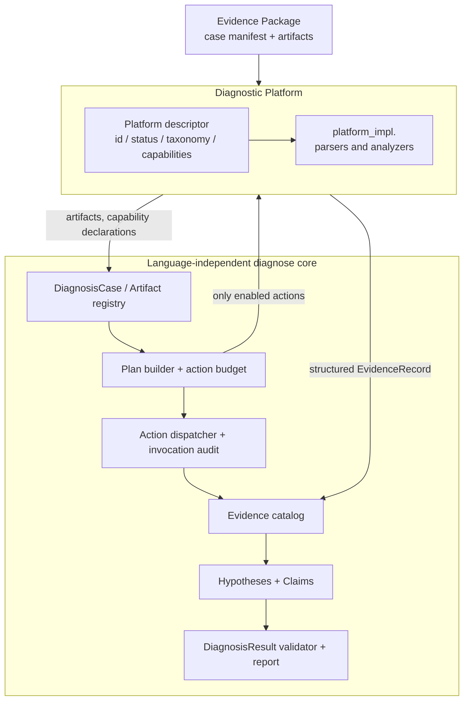
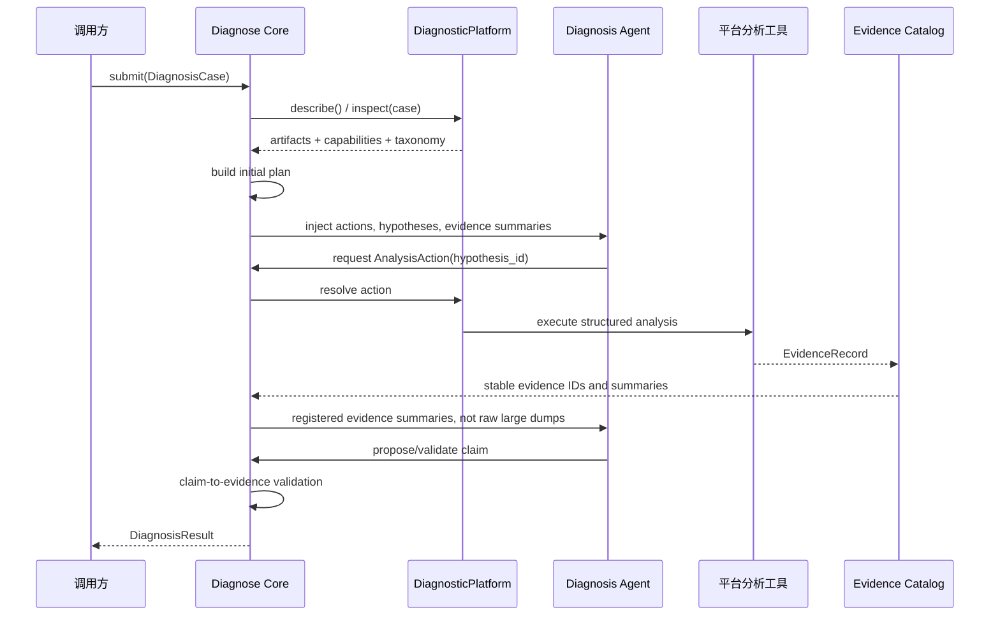
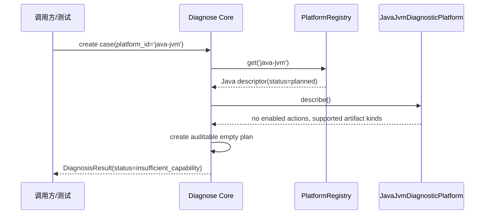

# 诊断内核一期实施方案

> 日期：2026-07-30  
> 目标：在现有 Agent runtime 上建立**语言无关、平台可扩展**的诊断领域顶层；一期只完成诊断内核和 Java/JVM 平台占位，不实现日志、thread dump、HPROF 或源码分析器。  
> 非目标：不改变修复/验证流程；不实现线上证据采集；不实现 Java 具体诊断工具；不以 `NotImplementedError` 作为功能占位。

## 1. 决策摘要

### 1.1 核心与平台的职责边界

系统分为两层。

| 层 | 负责的问题 | 不负责的问题 |
|---|---|---|
| `diagnose` 内核 | 如何管理 case、证据、假设、计划、工具调用审计、结论校验和报告 | 如何解析某个 dump，或某个错误类别在某运行时中意味着什么 |
| `diagnose.platform.<id>` | 某个目标平台能识别哪些证据、支持哪些分析能力、提供什么工具、有哪些 taxonomy 和默认分析动作 | 全局的证据 ID、跨平台报告格式、工具预算、结论合法性 |

内核只使用稳定抽象：`Artifact`、`Capability`、`AnalysisAction`、`EvidenceRecord`、`Hypothesis`、`Claim`、`DiagnosisResult`。

Java/JVM 平台将来才负责：如何从 thread dump、GC log、MAT/HPROF 摘要、源码和 `hs_err` 中提取这些抽象对象。

### 1.2 命名：不用 `RuntimeAnalysisPack`

`RuntimeAnalysisPack` 容易让人理解为“编程语言运行时”或“一个可安装的包”，而你要表达的是可被诊断的目标平台。例如 Java 服务、Python 服务、JVM 上的 Kotlin 服务，未必与语言一一对应。

一期采用以下命名：

```python
DiagnosticPlatform                 # 顶层抽象协议
JavaJvmDiagnosticPlatform          # 一期 Java/JVM 占位
```

`DiagnosticPlatform` 的含义是：一组针对某类目标系统的证据识别、能力声明、诊断 taxonomy、分析动作和关联规则。它可以覆盖“语言 + 运行时 + 服务形态”，但不会迫使未来 Python、Node.js、数据库或 Kubernetes 使用 Java 的概念。

### 1.3 目录：`diagnose/` + `diagnose/platform_impl/`

采用以下组织方式：

- `diagnose/`：只放稳定、语言无关的抽象和协调逻辑，包括模型、平台协议、registry、planner、catalog、session、校验和公共 API。
- `diagnose/platform_impl/<platform_id>/`：只放具体平台实现；每一个平台一个独立文件夹，例如 `java_jvm/`、未来的 `python_service/`。
- `diagnose/platform_impl/` 不定义新的抽象协议，它依赖并实现 `diagnose/` 中的 `DiagnosticPlatform`。
- 一期 Java/JVM 注册类只返回“计划中/未启用”的 descriptor；内核据此 fail closed，不把不存在的 Java 工具注入 Agent。

这比让每个平台内部再创建 `service/`、`impl/` 两层目录更直接：依赖方向固定为 `platform_impl -> diagnose`，而稳定抽象永远不会反向依赖任意具体平台。

## 2. 目标架构



### 2.1 首期运行边界

一期不启动真实诊断 Agent，不调用模型，也不向现有 `core.registry` 注册 Java 分析工具。它只交付可以被后续 Agent 编排直接复用的领域内核。

```text
输入 case manifest
  -> 选择已注册的平台
  -> 读取平台 descriptor
  -> 生成空的、可审计的诊断计划
  -> 校验和持久化 Hypothesis / Claim / EvidenceRecord
  -> 生成结构化 DiagnosisResult
```

由于 Java/JVM 平台状态为 `planned`，它不会声明可执行 action；内核输出的下一步是“平台分析能力尚未安装”，而不是制造一个总会抛异常的工具。Java/JVM 在本期只是**已知平台的注册占位**：可以接受并校验该平台的 case，不能执行任何诊断分析。

## 3. 端到端交互流程

### 3.1 后续完整形态



### 3.2 一期实际形态



一期测试可另用 `FakeDiagnosticPlatform` 注册一个内存 action，验证内核的计划、调度、证据链与结论校验；这不是 Java 功能实现。

## 4. 领域模型设计

所有模型放在 `diagnose/model/`。外部输入/输出使用 Pydantic；只在纯运行态维护 registry、cache、锁时使用 dataclass。

### 4.1 枚举

```python
class PlatformStatus(str, Enum):
    PLANNED = "planned"        # 已知平台但没有可执行分析能力
    AVAILABLE = "available"    # 可选择并执行至少一个分析动作
    DISABLED = "disabled"      # 已注册但被配置关闭


class ArtifactKind(str, Enum):
    LOG = "log"
    SOURCE = "source"
    BUILD_METADATA = "build_metadata"
    THREAD_SNAPSHOT = "thread_snapshot"
    HEAP_SNAPSHOT = "heap_snapshot"
    MEMORY_SUMMARY = "memory_summary"
    RUNTIME_CRASH_REPORT = "runtime_crash_report"
    UNKNOWN = "unknown"


class HypothesisStatus(str, Enum):
    PENDING = "pending"
    SUPPORTED = "supported"
    CONTRADICTED = "contradicted"
    CONFIRMED = "confirmed"
    INCONCLUSIVE = "inconclusive"


class ClaimStatus(str, Enum):
    VALIDATED = "validated"
    UNVALIDATED = "unvalidated"


class DiagnosisStatus(str, Enum):
    COMPLETE = "complete"
    INCONCLUSIVE = "inconclusive"
    INSUFFICIENT_CAPABILITY = "insufficient_capability"
    INVALID_INPUT = "invalid_input"
```

`ArtifactKind` 是跨平台的粗粒度分类。它不是文件扩展名，也不是 JVM 专有的 `hprof`。具体平台可在 `metadata` 中保存原始格式名，例如 `format: hprof`。

### 4.2 Case 和 Artifact

```python
class ArtifactRef(BaseModel):
    id: str
    kind: ArtifactKind
    path: str
    sha256: str | None = None
    size_bytes: int | None = None
    metadata: dict[str, JsonValue] = Field(default_factory=dict)


class DiagnosisCase(BaseModel):
    id: str
    platform_id: str
    root_dir: str
    artifacts: list[ArtifactRef] = Field(default_factory=list)
    metadata: dict[str, JsonValue] = Field(default_factory=dict)
```

内核要求调用方明确 `platform_id`。不在一期实现“根据文件猜平台”的全局路由，避免将 `*.log` 等模糊证据错误归属；以后可由一个独立 `PlatformResolver` 增加自动建议，但最终选择仍要可审计。

### 4.3 能力、动作与调用审计

```python
class Capability(BaseModel):
    id: str                       # 例："memory-retention-analysis"
    description: str
    required_artifact_kinds: set[ArtifactKind] = Field(default_factory=set)


class AnalysisActionSpec(BaseModel):
    id: str                       # 平台内唯一，例："thread.lock-graph"
    title: str
    description: str
    capability_id: str
    input_schema: dict[str, JsonValue]
    read_only: bool = True
    estimated_cost: int = 1  # 单位:action 调用次数(与 LLM token 无关);budget 同口径


class AnalysisActionRequest(BaseModel):
    action_id: str
    hypothesis_id: str | None = None
    arguments: dict[str, JsonValue] = Field(default_factory=dict)


class ActionInvocation(BaseModel):
    id: str
    action_id: str
    arguments: dict[str, JsonValue]
    hypothesis_id: str | None
    status: Literal["completed", "cached", "rejected", "failed"]
    evidence_ids: list[str] = Field(default_factory=list)
    reason: str | None = None
```

内核只允许执行 descriptor 中已声明、状态为 `AVAILABLE` 的 action。`PLANNED` 平台没有 action，故不需要 `NotImplementedError`。

### 4.4 证据、假设与结论

```python
class EvidenceLocation(BaseModel):
    artifact_id: str
    locator: str                  # 通用定位字串，如 line:120、thread:worker-1
    source_path: str | None = None
    line: int | None = None


class EvidenceDraft(BaseModel):
    dedup_key: str                # 分析器给出的稳定幂等键，不是展示 ID
    platform_id: str
    artifact_ids: list[str]
    analyzer_id: str
    summary: str
    locations: list[EvidenceLocation] = Field(default_factory=list)
    data: dict[str, JsonValue] = Field(default_factory=dict)
    confidence: float | None = Field(default=None, ge=0, le=1)


class EvidenceRecord(EvidenceDraft):
    id: str                       # 仅由 EvidenceCatalog 分配，如 EVD-0001
    invocation_id: str | None = None


class Hypothesis(BaseModel):
    id: str
    category: str                 # 由 platform taxonomy 定义
    statement: str
    status: HypothesisStatus = HypothesisStatus.PENDING
    supporting_evidence_ids: list[str] = Field(default_factory=list)
    contradicting_evidence_ids: list[str] = Field(default_factory=list)
    next_action_ids: list[str] = Field(default_factory=list)


class Claim(BaseModel):
    id: str
    statement: str
    status: ClaimStatus
    evidence_ids: list[str] = Field(default_factory=list)
    confidence: float | None = Field(default=None, ge=0, le=1)
    validation_note: str | None = None  # ClaimValidator 降级时填原因,跟着 claim 走,不散落 result/invocation
```

分析器未来产出 `EvidenceDraft`，由 `EvidenceCatalog` 登记后变为有稳定 ID 的 `EvidenceRecord`。`dedup_key` 是分析器生成的稳定幂等键，例如“分析器 ID + 规范化输入参数 + 证据位置”的哈希；它不是用户可见的证据编号。工具重试必须产生相同的 `dedup_key`，不同分析器即使 summary 相同也必须使用不同的 key。Catalog 因此不依赖 Python 对象身份或文本内容去重。

强制规则：`ClaimStatus.VALIDATED` 的 `evidence_ids` 必须非空，且所列 ID 必须存在于当前 case 的 `EvidenceCatalog`。不满足时由 validator 转成 `UNVALIDATED` 并将原因写入 claim 的 `validation_note`。

### 4.5 诊断输出

```python
class DiagnosisResult(BaseModel):
    case_id: str
    platform_id: str
    status: DiagnosisStatus
    root_cause_category: str = "unknown"
    root_cause: str | None = None
    causal_chain: list[str] = Field(default_factory=list)
    validated_claims: list[Claim] = Field(default_factory=list)
    unvalidated_claims: list[Claim] = Field(default_factory=list)
    hypotheses: list[Hypothesis] = Field(default_factory=list)
    evidence: list[EvidenceRecord] = Field(default_factory=list)
    invocations: list[ActionInvocation] = Field(default_factory=list)
    remediation_steps: list[str] = Field(default_factory=list)
    missing_capabilities: list[str] = Field(default_factory=list)
    follow_up_questions: list[str] = Field(default_factory=list)
```

一期中 `root_cause` 可为空。内核不应根据“平台为 Java”伪造根因。

## 5. 平台抽象与类设计

### 5.1 平台 descriptor

平台不能直接把任意 Python callable 暴露给 Agent。平台实现先声明 descriptor，内核再通过 session/executor 查询可执行 action。这使计划、工具注入和审计都可在实际执行前完成。

```python
class DiagnosticTaxonomy(BaseModel):
    categories: dict[str, str]    # id -> 人类可读说明
    unknown_category: str = "unknown"


class DiagnosticPlatformDescriptor(BaseModel):
    id: str
    display_name: str
    status: PlatformStatus
    description: str
    taxonomy: DiagnosticTaxonomy
    artifact_kinds: set[ArtifactKind] = Field(default_factory=set)
    capabilities: list[Capability] = Field(default_factory=list)
    actions: list[AnalysisActionSpec] = Field(default_factory=list)
```

### 5.2 平台协议

```python
class DiagnosticPlatform(Protocol):
    @property
    def descriptor(self) -> DiagnosticPlatformDescriptor: ...

    def inspect_case(self, case: DiagnosisCase) -> list[ArtifactRef]: ...

    def seed_hypotheses(self, case: DiagnosisCase) -> list[Hypothesis]: ...

```

使用约束：

- `inspect_case` 只做轻量、确定性的文件识别（存在性校验、`size_bytes`、`sha256`），不以后缀猜测 artifact kind；不得将大文件全文装入内存或发送模型。
- `seed_hypotheses` 只能产出平台 taxonomy 内的类别；一期 Java 占位返回空列表。

具体分析执行接口不属于一期。后续 Java 或其他平台真正提供 action 时，再以独立的 `ExecutableDiagnosticPlatform` 扩展协议加入 `execute(request, context) -> list[EvidenceDraft]`。本期 Java/JVM 占位没有 `execute()`，也不会出现空方法或 `NotImplementedError`。

### 5.3 Registry、Planner、Catalog、Validator

```python
class PlatformRegistry:
    def register(self, platform: DiagnosticPlatform) -> None: ...
    def get(self, platform_id: str) -> DiagnosticPlatform: ...
    def list_descriptors(self) -> list[DiagnosticPlatformDescriptor]: ...


class DiagnosisPlanner:
    def build_initial_plan(
        self,
        case: DiagnosisCase,
        descriptor: DiagnosticPlatformDescriptor,
        hypotheses: list[Hypothesis],
        budget: int,               # 允许的 action 调用次数上限(同 estimated_cost 口径,非 LLM token)
    ) -> DiagnosisPlan: ...

    def allowed_actions(
        self,
        descriptor: DiagnosticPlatformDescriptor,
        artifacts: list[ArtifactRef],
    ) -> list[AnalysisActionSpec]: ...


class EvidenceCatalog:
    def append(self, drafts: list[EvidenceDraft]) -> list[EvidenceRecord]: ...
    def get(self, evidence_id: str) -> EvidenceRecord | None: ...
    def all(self) -> list[EvidenceRecord]: ...


class ClaimValidator:
    def normalize(
        self,
        claim: Claim,
        catalog: EvidenceCatalog,
    ) -> Claim: ...
```

`EvidenceCatalog` 负责把 `EvidenceDraft` 转为有稳定顺序 ID 的 `EvidenceRecord`（一期采用 `EVD-0001` 格式），并拒绝 artifact/platform 不一致的证据。具体 Java 的友好 ID（如 `TD-LOCK-001`）等 Java 分析实现交付时再增加由平台提供的 ID prefix；内核不猜测它。

### 5.4 Agent 与内核的边界

后续 Agent 不直接拿 `DiagnosticPlatform` 或原始 artifact 路径，而是使用内核工具 API：

```python
class DiagnosisAgentFacade:
    def available_actions(self) -> list[AnalysisActionSpec]: ...
    async def run_action(self, request: AnalysisActionRequest) -> ActionInvocation: ...
    def evidence_summaries(self) -> list[EvidenceRecord]: ...
    def update_hypothesis(self, hypothesis: Hypothesis) -> None: ...
    def submit_claim(self, claim: Claim) -> Claim: ...
```

未来适配现有 [Tool](/Users/liweitian.7/CtData/code/py/pro/loop_engineer/core/tools.py:92) 时，`DiagnosisAgentFacade` 再被包装为 Agent tools。不要在一期将平台 `execute()` 直接塞进 `core.registry`，否则通用 Agent 和诊断 case 生命周期会耦合。

## 6. 目标文件编排

```text
diagnose/
  __init__.py
  errors.py                         # DiagnosisError、UnknownPlatformError 等
  api.py                            # 一期公共入口 create_diagnosis_session
  registry.py                       # PlatformRegistry
  session.py                        # DiagnosisSession：case 级状态与协调
  planner.py                        # DiagnosisPlanner、预算和 capability gating
  catalog.py                        # EvidenceCatalog
  validation.py                     # ClaimValidator、结果完整性校验
  model/
    __init__.py
    case.py                         # DiagnosisCase、ArtifactRef、ArtifactKind
    platform.py                     # Descriptor、Capability、ActionSpec、taxonomy
    evidence.py                     # EvidenceDraft、EvidenceRecord、EvidenceLocation
    hypothesis.py                   # Hypothesis、Claim、枚举
    plan.py                         # DiagnosisPlan、AnalysisActionRequest、Invocation
    result.py                       # DiagnosisResult
  platform.py                       # DiagnosticPlatform Protocol、execution context
  platform_impl/
    __init__.py                     # builtin platform registration factory
    java_jvm/
      __init__.py
      platform.py                   # JavaJvmDiagnosticPlatform 占位 descriptor
    python_service/
      __init__.py                   # 后续目录；一期不注册、不实现

tests/
  diagnose/
    __init__.py
    test_models.py
    test_registry.py
    test_planner.py
    test_catalog.py
    test_validation.py
    test_session.py
    platform/
      test_java_jvm_placeholder.py
      test_fake_platform_contract.py
```

命名说明：`platform_impl` 表明这是抽象层的具体实现目录，不是另一层抽象。`java_jvm` 只是第一个平台 ID；以后可以增加 `python_service`、`node_service`、`postgresql` 等，不要求它们有相同的底层运行时模型。

## 7. 一期实现计划

每个任务须先写失败测试，再实现最小代码。所有新代码使用 ASCII；中文 docstring 与现有工程保持一致。

### Task 1：建立模型和不变量

**文件：**

- 新建：`diagnose/model/{case,platform,evidence,hypothesis,plan,result}.py`
- 新建：`diagnose/model/__init__.py`
- 新建：`tests/diagnose/test_models.py`

**实现：**

- 实现第 4 节所有 Pydantic 模型与枚举。
- `DiagnosisResult` 不做跨 catalog 引用校验；该职责留给 validator。
- `Claim` 本身允许构造错误状态，方便后续 `ClaimValidator` 做降级，而不是让模型输出直接抛异常。

**测试与验收：**

- `ArtifactRef` 接受跨平台 `ArtifactKind`，不含 Java 字段。
- `EvidenceDraft` 的置信度超出 `[0, 1]` 时校验失败。
- `Claim(status=validated, evidence_ids=[])` 可以构造，但尚未被宣称为合法结果。
- 所有模型支持 `model_dump(mode="json")` 后重新 `model_validate()`。

### Task 2：实现平台协议与 Registry

**文件：**

- 新建：`diagnose/platform.py`
- 新建：`diagnose/registry.py`
- 新建：`diagnose/errors.py`
- 新建：`tests/diagnose/test_registry.py`

**实现：**

- `DiagnosticPlatform` Protocol 和 `PlatformExecutionContext`。
- `PlatformRegistry.register()`：平台 ID 唯一；重复注册抛领域异常。
- `get()`：未知 ID 抛 `UnknownPlatformError`，不返回 `None`。
- `list_descriptors()` 按 ID 排序，保证测试、日志和后续 prompt 稳定。

**测试与验收：**

- Registry 可注册纯内存 fake platform。
- 重复 ID、未知 ID 失败且信息明确。
- Registry 不 import `java_jvm`，平台的 builtin 注册由 `diagnose.platform_impl` 的显式工厂完成，避免隐式副作用。

### Task 3：实现 EvidenceCatalog 与 ClaimValidator

**文件：**

- 新建：`diagnose/catalog.py`
- 新建：`diagnose/validation.py`
- 新建：`tests/diagnose/test_catalog.py`
- 新建：`tests/diagnose/test_validation.py`

**实现：**

- Catalog 按插入顺序将 `EvidenceDraft` 登记为 `EVD-0001`、`EVD-0002` 等 `EvidenceRecord`。
- 相同 `dedup_key` 的 draft 重复 append 必须幂等，不重复编号；若同一 `dedup_key` 携带不同内容，拒绝并报告领域错误，防止分析器错误地复用 key。
- Validator：
  - `validated` 但无 ID -> 降级 `unvalidated`。
  - 引用不存在 ID -> 降级 `unvalidated`。
  - 存在有效 ID -> 原样保留。
- 降级原因写入被降级 claim 的 `validation_note` 字段（跟着 claim 走），不要静默修改；如需聚合审计可同时在 invocation audit 留痕。

**测试与验收：**

- 两个不同对象但相同 `dedup_key` 的 draft append 后不重复编号，覆盖工具重试场景。
- 同一 `dedup_key` 但不同内容的 draft 被明确拒绝。
- 多个 draft 登记后的 record ID 稳定且顺序确定。
- 无证据、未知证据、有效证据三种 claim 都被覆盖。
- 被降级的 claim 其 `validation_note` 非空且能说明原因。

### Task 4：实现 Planner 和 DiagnosisSession

**文件：**

- 新建：`diagnose/planner.py`
- 新建：`diagnose/session.py`
- 新建：`diagnose/api.py`
- 新建：`tests/diagnose/test_planner.py`
- 新建：`tests/diagnose/test_session.py`

**实现：**

- `allowed_actions()` 仅选择：
  - 平台状态为 `AVAILABLE`；
  - action 所属 capability 存在；
  - capability 所需 artifact kinds 被当前 case 满足；
  - action 预计成本不超过剩余预算。
- `DiagnosisSession` 持有：case、platform、descriptor、catalog、hypotheses、plan、invocations。
- `create_diagnosis_session()` 负责 resolve platform、调用轻量 `inspect_case()`、构造 initial plan。
- 调度入口一期只做 action gating（capability/artifact/budget）和重复请求缓存；任一不通过返回 `ActionInvocation(status="rejected", reason=...)`。当平台不是 `AVAILABLE` 时同样 `rejected`。具体 action 参数 schema 校验和平台执行接口均在平台具备真实 action 后再加入。
- 一期可提供 `build_result()`，但不构建 root cause。

**测试与验收：**

- fake platform 可按 artifact capability 暴露或隐藏 action。
- 相同 `action_id + normalized arguments + hypothesis_id` 第二次请求返回 `cached`。
- `PLANNED` 平台调用 action 返回 `rejected`，没有异常，也不会执行 fake `execute()`。
- `DiagnosisSession` 可生成 `INSUFFICIENT_CAPABILITY` 结果，并列出缺失 capability 或 platform 未启用原因。

### Task 5：Java/JVM 平台占位

**文件：**

- 新建：`diagnose/platform_impl/{__init__}.py`
- 新建：`diagnose/platform_impl/java_jvm/{__init__,platform}.py`
- 新建：`tests/diagnose/platform/test_java_jvm_placeholder.py`

**实现：**

- `JavaJvmDiagnosticPlatform.descriptor`：
  - `id="java-jvm"`
  - `status=PLANNED`
  - 描述为“Java/JVM 服务离线证据包诊断平台（一期仅占位）”。
  - 可声明未来接受的粗粒度 artifact kinds：`LOG`、`SOURCE`、`THREAD_SNAPSHOT`、`HEAP_SNAPSHOT`、`MEMORY_SUMMARY`、`RUNTIME_CRASH_REPORT`、`BUILD_METADATA`。
  - taxonomy 暂只含 `unknown`，不提前承诺未实现类别。
  - `capabilities=[]`，`actions=[]`。
- `ArtifactRef.path` 必须是相对 `case.root_dir` 的路径。`inspect_case()` 对调用方声明的每个 artifact 做轻量确定性识别：解析并确认其规范化路径仍位于 `case.root_dir` 内，校验文件存在、流式填充 `size_bytes` 与 `sha256`，原样保留调用方声明的 `kind`（不以后缀猜测 Java artifact kind）。
- Java 平台由 `diagnose.platform_impl.builtin_platform_registry()` 注册，但不是默认执行 Java 分析。

**测试与验收：**

- Java/JVM descriptor 正确、状态为 `planned`，没有 action。
- `inspect_case` 对真实文件流式填充 `size_bytes`/`sha256`，缺文件、绝对路径或 `..` 越界路径时明确报错而非静默忽略。
- Java case 创建 session 后生成 `INSUFFICIENT_CAPABILITY`，而不是 `COMPLETE` 或抛异常。
- `diagnose.platform_impl.java_jvm` 可 import，且没有可执行分析器、没有 `NotImplementedError`。
- `rg -n "NotImplementedError" diagnose/platform_impl/java_jvm` 无输出。

### Task 6：公共 API、文档与质量门禁

**文件：**

- 新建：`diagnose/__init__.py`
- 修改：`README.md`，仅增加“诊断领域内核一期”状态说明与入口示例。
- 新建：`docs/diagnosis/case-format.md`
- 新建：`tests/diagnose/test_public_api.py`

**实现：**

- 暴露最小公共 API：

```python
from diagnose import (
    DiagnosisCase,
    PlatformRegistry,
    builtin_platform_registry,
    create_diagnosis_session,
)
```

- `case-format.md` 明确一期调用方必须提供 `platform_id`、case ID、root dir 与 artifact list；不宣称支持自动 dump 识别。
- 文档说明 Java 平台只占位，不能分析生产证据。

**测试与验收：**

- 公共 API 能创建 Java/JVM session 并得到安全、明确的不足能力结果。
- `uv run pytest tests/diagnose -q` 全部通过。
- `uv run pytest -q` 全套通过。
- `uv run pyright diagnose` 无新增类型错误；若项目当前 pyright 命令要求不同，则记录实际命令与结果。

## 8. 完整验收清单

一期交付完成，必须同时满足：

- [ ] `diagnose/` 不依赖 `core/agent_loop.py`、Provider 或 LLM；它可以单独被普通 Python 调用。
- [ ] `diagnose/model/` 没有 Java、JVM、HPROF、ThreadLocal、Python 等平台专有字段。
- [ ] 平台 registry 可扩展、平台 ID 可审计，未知平台 fail closed。
- [ ] Java/JVM 是已知平台，但状态为 `PLANNED`：可以创建和轻量校验 case，不向调用方暴露 action，也不抛 `NotImplementedError`。
- [ ] 核心按 artifact capability 筛选 action；测试用 fake platform 覆盖该行为。
- [ ] 每个 `ActionInvocation` 有成功、缓存、拒绝或失败的明确状态与 reason。
- [ ] `EvidenceCatalog` 将未编号的 `EvidenceDraft` 分配为稳定 ID 的 `EvidenceRecord`，并支持幂等追加。
- [ ] `ClaimValidator` 不允许无证据的确定性结论静默通过。
- [ ] Java/JVM 占位可注册、可创建 session、可安全结束，但不会假装能诊断。
- [ ] 测试、类型检查和现有回归均通过。

## 9. 后续 Java/JVM 实现如何接入

Java 实现不需要改变内核接口。按以下顺序扩充 `diagnose/platform_impl/java_jvm/`：

1. `artifact_inspector.py`：识别日志、thread dump、GC log、MAT 摘要、源码、构建元数据。
2. `thread_dump_analyzer.py`：线程状态、锁图、死锁环、栈聚类、多快照差分。
3. `log_analyzer.py`：异常簇、时间线、相关 ID。
4. `source_mapper.py`：stack frame 到源码、符号和引用的关联。
5. `heap_summary_analyzer.py`：先消费 MAT 结构化摘要，最后才考虑原始 HPROF。
6. `correlation_service.py`：把日志、线程、堆和源码的证据转为支持/反驳关系。

届时定义独立的 `ExecutableDiagnosticPlatform` Protocol，并由真实 Java/JVM 平台实现：

```python
class ExecutableDiagnosticPlatform(DiagnosticPlatform, Protocol):
    async def execute(
        self,
        request: AnalysisActionRequest,
        context: PlatformExecutionContext,
    ) -> list[EvidenceDraft]: ...
```

`DiagnosisSession` 在该平台为 `AVAILABLE` 且实现这一协议时，才允许调用 `execute()`，再将返回的 drafts 登记到 `EvidenceCatalog`。这一“平台执行 -> Catalog 登记 -> EvidenceRecord -> Claim 引用”的集成路径依赖真实 Java/JVM action，不属于一期；一期仅用单元测试覆盖 Catalog 的 ID 分配、`dedup_key` 幂等和冲突拒绝规则。

届时再把 Java descriptor 改为 `AVAILABLE`，增加 capability/action spec，扩展 Java taxonomy；每增加一个 action 就增加相应 case fixture、answer key 和上述集成测试。不要在 descriptor 中先列出还不能执行的 action。

## 10. 明确不做

- 不把 Java 平台实现为 `LanguagePack`；未来平台可以不是语言。
- 不在一期扫描任意目录、猜测 JVM dump 或解析大文件（但允许对调用方已声明且位于 case root 内的 artifact 做存在性/hash/size 的确定性校验）。
- 不在一期注册面向模型的 `AnalyzeThreadDump`、`AnalyzeHeap` 等 Tool。
- 不把 `EvidenceRecord` 存进通用 `AgentState`；诊断 session 才是 case 生命周期的权威状态。
- 不让模型直接读完整 heap dump 或以自由文本认定根因。
- 不在平台目录内部再引入 `service/impl` 分层；稳定的 service contract 已在 `diagnose/`，具体实现只在 `diagnose/platform_impl/<platform_id>/`。
- 不引入 repository/DAO 结构；当前没有持久化数据库，JSON 仍由调用方或后续 case storage 决定。

## 11. Agent/MCP 集成修订

诊断产品由 Agent 主导。具体 MCP 和 core 工具直接进入 Agent 的工具池，保留 MCP
自身的工具描述、参数 schema 和可替换性；`diagnose` 不把它们改名或映射成一套 JVM
专用 action。

```text
Agent 直接调用 MCP/core 分析工具
  -> Agent 基于工具输出判断哪些发现值得纳入证据链
  -> Agent 用 CaptureDiagnosisEvidence 将发现、关键输出和 case artifact 关联
  -> EvidenceCatalog 登记 EVD-*
  -> Agent 更新假设、提交 claim
  -> FinalizeDiagnosis 检查证据状态，而非检查是否调用了某个固定 MCP 工具
```

稳定诊断控制工具：

- `GetDiagnosisContext`
- `CaptureDiagnosisEvidence`
- `ReadDiagnosisEvidence`
- `UpdateDiagnosisHypothesis`
- `SubmitDiagnosisClaim`
- `FinalizeDiagnosis`

`FinalizeDiagnosis` 的闸门不能要求“调用完整工具集”。它只要求：确定性 claim 必须
引用当前 case 的 EVD；平台语义规则不得被违反。
这使 MCP server 或具体 tool 更换时，诊断流程和证据链保持稳定。

Java/JVM 平台在此模型中的职责是轻量 profile：artifact 校验、taxonomy、调查规则和
claim 语义校验。例如 `BLOCKED` 不等于 deadlock，单份 heap histogram 不等于 heap leak。
它不要求自行实现 HPROF 或 thread dump 的完整解析器；优先复用 Agent 直接调用的 MCP/
core 工具，只有在工具缺失时才新增专用分析实现。
