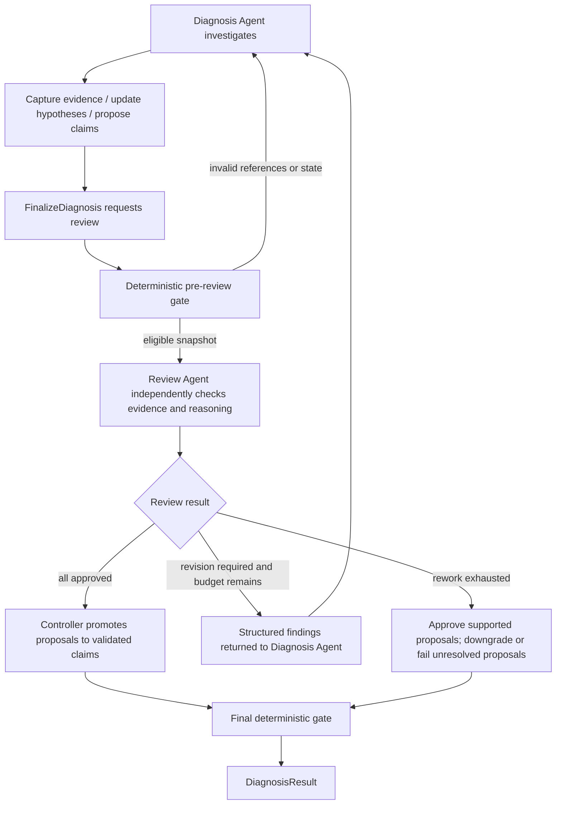

# Diagnosis Adversarial Review v1 Implementation Plan

> Date: 2026-08-03
> Status: implemented on 2026-08-03

## 1. Goal

Add a configurable, adversarial review loop to the existing Agent-first diagnosis workflow.
The diagnosis Agent investigates the case and proposes conclusions. A separate review Agent
independently checks whether those conclusions are supported by the referenced evidence and
whether the evidence was interpreted within its limits. Only the workflow controller may
promote a proposal to a validated claim.

This plan fixes the current semantic weakness where `SubmitDiagnosisClaim` accepts an
Agent-supplied `status=validated`, while deterministic validation only checks evidence IDs and
a small set of natural-language markers.

The v1 scope is language-independent at the workflow and model layers. Java/JVM supplies the
first platform-specific claim policy. The design must leave a direct path for a future
`python_service` implementation.

## 2. Non-goals

- Do not implement skill-based runtime/tool registration.
- Do not add cross-run persistence, queues, databases, or resumable workflows.
- Do not restore `ToolExecutionObserver` or modify the core tool executor to capture every tool
  result automatically.
- Do not wrap TDA/JProfiler MCP tools in fixed diagnostic semantic tools.
- Do not implement thread-dump or HPROF parsing inside `diagnose`.
- Do not automatically derive `root_cause`, `causal_chain`, remediation, or
  `DiagnosisStatus.COMPLETE` in this iteration. Existing `root_cause=None` behavior remains.
- Do not use an LLM review result to bypass deterministic reference, taxonomy, or stale-state
  checks.
- Do not infer claim category, polarity, or time basis from natural-language `statement` text.
- Do not modify the generic Agent loop, MCP adapter, registry, or tool executor unless an
  implementation blocker is demonstrated. Adding explicit, typed diagnosis bindings to the
  existing flat `AgentState` is in scope.

## 3. Architectural Decisions

### 3.1 Validation is a promotion, not a diagnosis-Agent assertion

Replace the diagnosis Agent's final `Claim` submission with a `ClaimProposal`. A proposal has no
`validated` status. It becomes a final `Claim(status=VALIDATED)` only after:

1. language-independent deterministic checks pass;
2. the platform claim policy finds no blocking issue; and
3. the review Agent explicitly approves the proposal against a matching session revision.

If review is disabled explicitly, proposals may be emitted as `UNVALIDATED`, but they must never
be promoted to `VALIDATED`. This preserves the meaning of validated across all configurations.

### 3.2 Review raw evidence interpretation, not the existence of files

Artifact existence, path confinement, evidence-ID existence, taxonomy membership, and state
transition legality remain deterministic code responsibilities.

The review Agent checks questions that require diagnostic judgment:

- Does each referenced evidence record actually support the proposal?
- Did the diagnosis Agent confuse a symptom, correlation, retention, or one-time observation
  with a root cause or persistent failure?
- Are negative findings represented as contradicted hypotheses instead of positive claims?
- Is material contradictory evidence omitted?
- Are multiple claims mutually inconsistent?
- Are confidence and scope stronger than the evidence permits?

The reviewer may use the same read-only MCP analysis tools to independently verify referenced
artifacts. It may not mutate the session's evidence, hypotheses, or proposals.

### 3.3 One session, two isolated Agent conversations

One `DiagnosisSession` remains the only **domain state** for a run. The diagnosis Agent and review
Agent use separate `AgentState` instances and message histories. They share the same session and
may share a started MCP manager sequentially. No review conversation is copied into the
diagnosis Agent history; only structured review findings are injected for rework.

`AgentState` is the flat runtime-state carrier from the Agent loop into `ToolContext`. It may be
extended with typed diagnosis bindings when a tool needs trusted execution context that should
not be supplied by the model. For v1 add:

```python
# core/types.py, AgentState
diagnose_session: DiagnosisSession | None = None       # existing
diagnose_actor: Literal["diagnostician", "reviewer"] | None = None
diagnose_review_round: int | None = None
diagnose_review_revision: int | None = None
```

The split is intentional:

- `DiagnosisSession` owns evidence, hypotheses, proposals, revision, review history, and final
  claims because these are business facts returned in `DiagnosisResult`;
- `AgentState` owns the current Agent's role and review binding because these are ephemeral
  execution facts used by tools through `ToolContext`;
- `QueryState` remains turn-local and must not hold cross-submit diagnosis state;
- do not add an untyped `diagnosis_data: dict` escape hatch. Keep the flat fields explicit and
  type checked.

The controller sets these fields. Tools treat them as authoritative and fail closed when the
actor, round, or revision does not match. Model-provided review metadata is never sufficient by
itself.

### 3.4 Configurable but fail-closed review

```python
class ReviewMode(str, Enum):
    REQUIRED = "required"
    DISABLED = "disabled"


class UnresolvedReviewAction(str, Enum):
    DOWNGRADE = "downgrade"
    FAIL = "fail"


class DiagnosisReviewPolicy(BaseModel):
    mode: ReviewMode = ReviewMode.REQUIRED
    max_rework_rounds: int = Field(default=1, ge=0, le=5)
    unresolved_action: UnresolvedReviewAction = UnresolvedReviewAction.DOWNGRADE
    allow_reviewer_mcp: bool = True
```

`max_rework_rounds` counts diagnosis-Agent repair turns after the first review. Therefore:

- `0`: diagnose once, review once, then downgrade/fail unresolved items;
- `1`: diagnose, review, one rework, review again;
- `N`: at most `N + 1` review passes.

The default is one rework. A hard upper bound prevents unbounded Agent debate.

### 3.5 Reviewer decisions are structured and revision-bound

Every mutation to evidence, hypotheses, or proposals increments `session.revision`. A review
submission contains `reviewed_revision`. The session rejects stale reviews. This prevents a
review approval from being applied after the diagnosis Agent has changed the evidence chain.

Review decisions are per proposal, while the overall decision controls whether rework is needed.
The reviewer cannot approve proposal IDs that do not exist in the reviewed snapshot.

## 4. Target Flow



## 5. Domain Model

### 5.1 Claim proposal

Add to `diagnose/model/hypothesis.py`:

```python
class EvidenceTimeBasis(str, Enum):
    POINT_IN_TIME = "point_in_time"
    MULTI_SNAPSHOT = "multi_snapshot"
    INTERVAL_PROFILE = "interval_profile"
    EVENT_SEQUENCE = "event_sequence"
    STATIC = "static"
    UNKNOWN = "unknown"


class ClaimProposal(BaseModel):
    id: str
    category: str
    statement: str
    evidence_ids: list[str] = Field(default_factory=list)
    artifact_ids: list[str] = Field(default_factory=list)
    time_basis: EvidenceTimeBasis = EvidenceTimeBasis.UNKNOWN
    confidence: float | None = Field(default=None, ge=0, le=1)
```

`Claim` remains the result model, but add required `category` and `time_basis` so final claims do
not lose the proposal's machine-readable semantics:

```python
class Claim(BaseModel):
    id: str
    category: str
    statement: str
    status: ClaimStatus
    evidence_ids: list[str] = Field(default_factory=list)
    artifact_ids: list[str] = Field(default_factory=list)
    time_basis: EvidenceTimeBasis = EvidenceTimeBasis.UNKNOWN
    confidence: float | None = Field(default=None, ge=0, le=1)
    validation_note: str | None = None
```

This is an intentional internal schema migration. Update all constructors and tests in the same
change; do not retain statement-keyword fallback behavior.

Claim proposals represent positive asserted facts only. Refutations continue to use
`Hypothesis(status=CONTRADICTED)`. Unresolved candidates use
`Hypothesis(status=INCONCLUSIVE)`.

### 5.2 Hypothesis reviewability

Add `status_note: str | None = None` to `Hypothesis`. It explains why an item is inconclusive or
why review downgraded it. Do not add a second hypothesis-review status enum.

State invariants:

| Hypothesis status | Required deterministic state |
|---|---|
| `PENDING` | no requirement during investigation; not terminal at finalize |
| `SUPPORTED` | non-empty existing `supporting_evidence_ids`; not terminal at finalize |
| `CONFIRMED` | non-empty existing `supporting_evidence_ids` |
| `CONTRADICTED` | non-empty existing `contradicting_evidence_ids` |
| `INCONCLUSIVE` | non-empty `status_note`; evidence optional |

Supporting and contradicting evidence sets must be disjoint. Every referenced ID must exist.
`category` must belong to the platform taxonomy.

### 5.3 Review models

Create `diagnose/model/review.py`:

```python
class ReviewDecision(str, Enum):
    APPROVED = "approved"
    REVISION_REQUIRED = "revision_required"


class ProposalReviewVerdict(str, Enum):
    APPROVE = "approve"
    REVISE = "revise"
    REJECT = "reject"


class ReviewSeverity(str, Enum):
    ERROR = "error"
    WARNING = "warning"


class ReviewFinding(BaseModel):
    code: str
    severity: ReviewSeverity
    target_type: Literal["claim_proposal", "hypothesis", "evidence", "diagnosis"]
    target_id: str | None = None
    message: str
    evidence_ids: list[str] = Field(default_factory=list)
    required_evidence: list[str] = Field(default_factory=list)


class ProposalReview(BaseModel):
    proposal_id: str
    verdict: ProposalReviewVerdict
    rationale: str
    finding_codes: list[str] = Field(default_factory=list)


class DiagnosisReview(BaseModel):
    reviewed_revision: int
    decision: ReviewDecision
    proposal_reviews: list[ProposalReview]
    findings: list[ReviewFinding] = Field(default_factory=list)


class ReviewCycle(BaseModel):
    round_index: int
    review: DiagnosisReview
```

Deterministic consistency rules:

- every current proposal has exactly one `ProposalReview`;
- no unknown or duplicate proposal ID is accepted;
- `APPROVED` overall requires every proposal verdict to be `APPROVE` and no `ERROR` finding;
- `REVISION_REQUIRED` requires at least one `REVISE`/`REJECT` verdict or `ERROR` finding;
- all finding evidence IDs must exist;
- `reviewed_revision` must equal the session revision captured by `FinalizeDiagnosis`.

### 5.4 Workflow result status

Add `DiagnosisStatus.INCOMPLETE = "incomplete"`. This is returned when the diagnosis Agent ends
normally at the core Agent layer but never successfully calls `FinalizeDiagnosis`, when the
review Agent fails to submit a valid review, or when policy is `FAIL` and review cannot resolve.
Natural-language Agent output must never be treated as a formal diagnosis result.

Add `review_history: list[ReviewCycle]` and `review_complete: bool` to `DiagnosisResult`.

## 6. Session State Machine

Extend `DiagnosisSession` with:

```python
self.claim_proposals: dict[str, ClaimProposal] = {}
self.review_history: list[ReviewCycle] = []
self.revision: int = 0
self.review_requested_revision: int | None = None
self.review_complete: bool = False
self.workflow_incomplete_reason: str | None = None
```

Mutation rules:

- `capture_evidence`, a materially changed `update_hypothesis`, and a materially changed
  `submit_claim_proposal` increment `revision` and clear any pending/complete review state.
- Idempotent resubmission of identical content does not increment `revision`.
- Proposal IDs are upserts. An existing ID may be revised before final promotion.
- Promoted claims are immutable for that terminal result.
- `request_review()` first runs deterministic proposal/hypothesis checks. On success it stores
  `review_requested_revision = revision` and returns a read-only review snapshot.
- `submit_review()` validates the structured decision and revision, then appends one cycle.
- The workflow controller, not the reviewer tool, calls `apply_review()`.
- `apply_review()` promotes approved proposals and handles rejected/unresolved proposals
  according to policy.

`finalize_gate()` must check all of the following:

1. every hypothesis is terminal (`CONFIRMED`, `CONTRADICTED`, or `INCONCLUSIVE`);
2. hypothesis evidence-reference invariants hold;
3. every claim proposal has a terminal reviewed outcome;
4. every validated claim came from an approved proposal in the latest applicable review;
5. every final claim references existing evidence and known case artifacts;
6. review is complete when policy mode is `REQUIRED`;
7. no stale review exists after the last mutation.

## 7. Deterministic Validation Layers

Split current validation responsibilities explicitly:

### 7.1 Language-independent proposal validator

Replace `ClaimValidator.normalize(claim, catalog)` with a validator that returns structured
issues for `ClaimProposal` and never silently promotes it:

```python
class ValidationIssue(BaseModel):
    code: str
    message: str
    target_id: str | None = None
    blocking: bool = True


class ClaimProposalValidator:
    def validate(
        self,
        proposal: ClaimProposal,
        *,
        catalog: EvidenceCatalog,
        case: DiagnosisCase,
        taxonomy: DiagnosticTaxonomy,
    ) -> list[ValidationIssue]: ...
```

Checks: non-empty evidence, existing evidence IDs, known artifact IDs, category in taxonomy,
proposal artifact IDs consistent with referenced evidence, and duplicate evidence IDs.

### 7.2 Platform policy

Change `DiagnosticPlatform.validate_claim` to
`validate_claim_proposal(proposal, referenced_evidence) -> list[ValidationIssue]`. The base
implementation returns no issues. Platform code must use explicit proposal fields and structured
evidence data; it must not parse `statement` for keywords or negation.

Java/JVM v1 expects material MCP findings to be registered under:

```python
data={
    "finding": {
        "kind": "deadlock_cycle",
        "outcome": "present",
        "scope": "thread_snapshot",
        "details": {...},
    }
}
```

Supported Java finding kinds for policy checks:

| Claim category | Minimum structured finding and time basis |
|---|---|
| `deadlock` | `deadlock_cycle/outcome=present`; point-in-time is sufficient for that dump |
| `lock_contention` | `monitor_contention/outcome=present` with holder/waiter details |
| `memory_retention` | `retained_objects`, `dominator`, or `retention_path`; point-in-time allowed |
| `heap_leak` | growth finding plus `MULTI_SNAPSHOT` or `EVENT_SEQUENCE` |
| `cpu_hotspot` | CPU profile with `INTERVAL_PROFILE`, or repeated hot stacks with `MULTI_SNAPSHOT` |
| `thread_starvation` | saturated pool/resource evidence with queued work or rejection evidence |
| `runtime_crash` | fatal JVM event from crash report or matching fatal log sequence |

Unrecognized categories are already rejected by taxonomy validation. Missing or malformed
structured findings create blocking issues. The review Agent still checks whether the Agent's
structured transcription matches the actual tool output.

Delete `_marker_has_positive_hit`, `_NEGATION_PREFIXES`, and all statement/evidence-text marker
matching from Java `platform.py` after the structured rules are covered by tests.

## 8. Agent Tools and Prompts

### 8.1 Diagnosis Agent tools

Keep these tools:

- `GetDiagnosisContext`
- `CaptureDiagnosisEvidence`
- `ReadDiagnosisEvidence`
- `UpdateDiagnosisHypothesis`
- `FinalizeDiagnosis`

Replace `SubmitDiagnosisClaim` with `ProposeDiagnosisClaim`. Its input is a
`ClaimProposal`; there is no status supplied by the Agent.

`FinalizeDiagnosis` no longer returns `session.build_result()` immediately. It calls
`session.request_review()` and returns one of:

```json
{"status": "review_requested", "revision": 7}
```

or

```json
{"status": "rejected", "reasons": [...]}
```

Update the diagnosis reminder to state:

- positive facts use `ProposeDiagnosisClaim`;
- refuted candidates use `CONTRADICTED` hypotheses;
- unknown candidates use `INCONCLUSIVE` with `status_note`;
- evidence `data.finding` must reflect material MCP output;
- `FinalizeDiagnosis` hands the proposal to an independent reviewer;
- review findings must be addressed explicitly during rework.

### 8.2 Review Agent tools

Create `diagnose/review_tools.py` with only:

- `GetDiagnosisReviewContext`: returns case summary, artifacts, current evidence, hypotheses,
  proposals, deterministic issues, revision, and prior review findings;
- `ReadDiagnosisEvidence`: read-only evidence lookup;
- `SubmitDiagnosisReview`: accepts `DiagnosisReview` and stores it after deterministic validation.

The review Agent must not receive diagnosis mutation tools. Use a separate `AgentConfig` and
`AgentState`. The workflow binds `diagnose_actor="reviewer"`, the expected review round, and the
requested session revision on that state before calling the reviewer. Diagnosis tools require
`diagnose_actor="diagnostician"`; review submission requires `diagnose_actor="reviewer"`.

The reviewer may see normal core tools, but enforce a review-specific `can_use_tool` policy:

- allow `Read`, `Glob`, `Grep`, and `LSP`;
- allow MCP tools only when `policy.allow_reviewer_mcp` is true;
- deny `Edit`, `Write`, `Bash`, `Load_Skill`, and all diagnosis mutation tools;
- allow only the three review control tools above.

Implement this in `diagnose/reviewer.py`; do not change `core.registry` or the core tool executor.
MCP tools remain original MCP tools with their original schemas.

Reviewer prompt requirements:

- assume the diagnosis may be wrong;
- check every proposal and every terminal hypothesis;
- inspect referenced evidence, not only claim wording;
- independently rerun a read-only MCP analysis when a decisive assertion is not verifiable from
  captured evidence;
- reject semantic overreach and contradictory claims;
- produce exactly one structured `SubmitDiagnosisReview` call before ending.

## 9. Workflow Controller

Create `diagnose/workflow.py`:

```python
@dataclass
class DiagnosisWorkflow:
    session: DiagnosisSession
    diagnosis_config: AgentConfig
    review_config: AgentConfig | None
    review_policy: DiagnosisReviewPolicy
    tracer: Tracer

    async def run(self, prompt: str) -> DiagnosisResult: ...
```

The controller owns both Agent states and the loop:

1. build isolated diagnosis and review `AgentState` objects;
2. bind the same `DiagnosisSession` to each state and set their distinct `diagnose_actor` values;
3. submit the initial diagnosis prompt and drain all events;
4. require `session.review_requested_revision` to be set by `FinalizeDiagnosis`;
5. in `DISABLED` mode, downgrade every proposal and build an unreviewed result;
6. in `REQUIRED` mode, set the review state's trusted `diagnose_review_round` and
   `diagnose_review_revision`, then run the reviewer against that revision;
7. require a valid `DiagnosisReview` to appear in session state;
8. if revision is required and rework remains, inject only structured findings into the existing
   diagnosis Agent state and run another submit;
9. require another successful `FinalizeDiagnosis` request after rework;
10. when approved, promote approved proposals;
11. when rework is exhausted, apply `unresolved_action`;
12. run `finalize_gate()` and return the formal result;
13. always shut down both Agent states; MCP/provider lifecycle remains caller-owned for v1.

Do not infer success from the result event emitted by core `submit()`. That event only means the
Agent loop ended normally. Formal completion is determined exclusively from session state.

Rework input format:

```text
<system-reminder>
The independent diagnosis review requires revision. Address every ERROR finding, update the
evidence/hypotheses/proposals as needed, then call FinalizeDiagnosis again.
</system-reminder>
<diagnosis-review revision="7" round="0">
{structured DiagnosisReview JSON}
</diagnosis-review>
```

No free-form reviewer conversation is copied to the diagnosis Agent.

## 10. File Plan

| File | Action | Responsibility |
|---|---|---|
| `core/types.py` | modify | flat typed diagnosis actor/review bindings on `AgentState` |
| `diagnose/model/hypothesis.py` | modify | proposal, time basis, claim schema, hypothesis note |
| `diagnose/model/review.py` | create | review policy, findings, decisions, cycles |
| `diagnose/model/result.py` | modify | incomplete status and review history |
| `diagnose/model/__init__.py` | modify | export new models |
| `diagnose/validation.py` | rewrite | proposal/reference/taxonomy checks |
| `diagnose/platform.py` | modify | structured proposal-policy hook |
| `diagnose/session.py` | modify | proposal store, revision, review state machine, final gates |
| `diagnose/agent_tools.py` | modify | proposal and review-request tools |
| `diagnose/review_tools.py` | create | reviewer-only control tools |
| `diagnose/reviewer.py` | create | reviewer config, prompt, permission policy |
| `diagnose/workflow.py` | create | bounded diagnose-review-rework loop |
| `diagnose/agent.py` | modify | proposal/review semantics in reminder |
| `diagnose/platform_impl/java_jvm/platform.py` | modify | structured Java claim policy |
| `diagnose/platform_impl/java_jvm/guidance.py` | modify | finding schema and conclusion boundary guidance |
| `scripts/diagnose_runtime_demo.py` | modify | run workflow instead of raw single Agent submit |
| `tests/diagnose/test_review_models.py` | create | review model invariants |
| `tests/diagnose/test_validation.py` | rewrite/extend | proposal validator tests |
| `tests/diagnose/test_session.py` | extend | revision and review state-machine tests |
| `tests/diagnose/test_agent_controls.py` | modify | diagnosis tools and finalize request tests |
| `tests/diagnose/test_review_tools.py` | create | reviewer context/submission tests |
| `tests/diagnose/test_workflow.py` | create | fake-Agent workflow orchestration tests |
| `tests/diagnose/platform/test_java_jvm_claim_guard.py` | rewrite | structured Java policy tests |
| `tests/diagnose/test_models.py` | modify | schema migration tests |
| `tests/diagnose/test_input_compat.py` | modify | nested JSON compatibility for proposals/reviews |

Only `core/types.py` is expected to change in `core/`: extend the existing flat `AgentState` with
the three typed bindings defined in section 3.3. This is an approved dependency direction because
`ToolContext` already carries `AgentState`, and diagnosis control tools already obtain
`diagnose_session` through it. Do not move domain models or review state into core, and do not
change `core.agent_loop`, `core.registry`, `core.mcp`, or `core.tool_executor` for v1 unless tests
expose a concrete blocker.

## 11. Implementation Tasks

### Task 1: Add proposal and review domain models

1. Write model tests for `EvidenceTimeBasis`, `ClaimProposal`, migrated `Claim`, hypothesis
   `status_note`, review policy bounds, review decisions, and result review fields.
2. Add `diagnose/model/review.py` and update model exports.
3. Update all existing Claim constructors with explicit `category` and `time_basis`.
4. Run model and input-compatibility tests.

Acceptance:

- invalid confidence/rework bounds fail Pydantic validation;
- proposals cannot carry `status`;
- final claims require a category;
- all new public model symbols import from `diagnose.model`.

### Task 2: Replace ClaimValidator with deterministic proposal validation

1. Write tests for missing evidence, unknown evidence, unknown artifacts, taxonomy mismatch,
   duplicate IDs, and evidence/artifact inconsistency.
2. Implement `ValidationIssue` and `ClaimProposalValidator`.
3. Keep no compatibility path that validates natural-language statement keywords.

Acceptance:

- validator is pure and does not mutate a proposal or catalog;
- every error has a stable machine `code`;
- valid proposals pass independently of wording and language.

### Task 3: Implement the session revision and review state machine

1. Add failing tests for revision increments and idempotent upserts.
2. Add failing tests for hypothesis status/reference invariants.
3. Add failing tests for review request snapshots, stale review rejection, malformed review
   rejection, and partial proposal outcomes.
4. Implement proposal storage, `request_review`, `submit_review`, `apply_review`, and the expanded
   `finalize_gate`.
5. Update `build_result` to include review history and incomplete status.

Acceptance:

- a fake `EVD-9999` cannot confirm or contradict a hypothesis;
- mutation after approval invalidates that approval;
- an Agent cannot directly place a claim in `validated_claims`;
- disabled review produces no validated claim;
- approved proposals preserve category, evidence, artifacts, time basis, and confidence.

### Task 3.5: Add trusted diagnosis bindings to AgentState

1. Add `diagnose_actor`, `diagnose_review_round`, and `diagnose_review_revision` as explicit flat
   fields on `core.types.AgentState`, beside the existing `diagnose_session` field.
2. Keep imports under `TYPE_CHECKING` where needed and avoid a runtime `core -> diagnose` import.
3. Add focused tests proving defaults are `None`, diagnosis/reviewer states can carry independent
   bindings, and `ToolContext` exposes the same bound state object to tools.
4. Add shared helpers in the diagnosis layer to require the expected actor and trusted review
   binding; do not duplicate ad-hoc checks in every tool.

Acceptance:

- `AgentState` remains a flat dataclass with typed fields, not a generic state dictionary;
- constructing core-only `AgentState()` still works without importing `diagnose` at runtime;
- a reviewer tool rejects a diagnostician state and vice versa;
- review round/revision used by the tool come from `ToolContext.agent_state`, and mismatched
  model-supplied values are rejected.

### Task 4: Migrate diagnosis control tools

1. Replace the submit-claim input/tool with proposal input/tool.
2. Make `FinalizeDiagnosis` request a review snapshot rather than returning the result.
3. Update reminders and JSON-string compatibility validators.
4. Add tests using real `ToolContext` and `DiagnosisSession`.

Acceptance:

- no model-visible tool accepts `ClaimStatus.VALIDATED`;
- finalize with pending/supported hypotheses is rejected with actionable reasons;
- successful finalize returns `review_requested` and a revision, not a result.

### Task 5: Implement reviewer-only controls and permission policy

1. Add `GetDiagnosisReviewContext`, reviewer evidence read, and `SubmitDiagnosisReview`.
2. Add `configure_diagnosis_review_agent` with a dedicated reminder.
3. Compose a `can_use_tool` function that enforces the read-only policy and preserves any stricter
   caller policy.
4. Test denial of mutation tools and conditional MCP allowance.

Acceptance:

- reviewer cannot call capture/update/propose/finalize tools;
- reviewer cannot edit files or run Bash;
- reviewer can read evidence and submit exactly one current-revision review;
- reviewer cannot overwrite an existing review for the same round.

### Task 6: Implement the bounded workflow controller

1. Introduce a small internal `AgentRunner` protocol so unit tests can script Agent outcomes
   without calling a real model. The production implementation drains `core.agent_loop.submit()`.
2. Test approved first pass, one rework then approval, zero-rework downgrade, exhaustion failure,
   diagnosis Agent omission of finalize, reviewer omission of review submission, stale review,
   and cleanup on exception.
3. Implement `DiagnosisWorkflow.run`.

Acceptance:

- review calls never exceed `max_rework_rounds + 1`;
- diagnosis rework calls never exceed `max_rework_rounds`;
- normal core Agent completion without domain finalization returns `INCOMPLETE`;
- controller never parses free-form Agent text to decide review state;
- diagnosis and reviewer message histories are distinct objects.

### Task 7: Replace Java keyword guards with structured policy

1. Rewrite Java claim-guard tests using `ClaimProposal.category`, `time_basis`, and
   `EvidenceRecord.data.finding`.
2. Implement the policy table in section 7.2.
3. Delete statement keyword/negation parsing helpers.
4. Update Java guidance with exact structured finding expectations and limits.

Required regression cases:

- `No deadlock exists` is never parsed as a deadlock claim; it belongs to a contradicted
  hypothesis.
- `deadlock` proposal plus `deadlock_cycle/outcome=absent` is blocked.
- lock contention from holder/waiter evidence is allowed without a cycle.
- one thread snapshot cannot validate persistent `cpu_hotspot`.
- interval CPU profile can support `cpu_hotspot`.
- one heap snapshot can support `memory_retention` but not `heap_leak`.
- multi-snapshot growth can support `heap_leak`.

Acceptance:

- Java platform never reads `proposal.statement` for policy decisions;
- platform issues use stable codes;
- all rules inspect only the proposal and its referenced evidence.

### Task 8: Integrate the end-to-end demo

1. Update `scripts/diagnose_runtime_demo.py` to create one session, one Java MCP manager, isolated
   diagnosis/review configs, and `DiagnosisWorkflow`.
2. Add environment/config options for reviewer model and review policy while defaulting to the
   diagnosis model and one rework.
3. Preserve current output path and include review history in JSON.
4. Ensure manager, Agent states, pending extraction, and provider are closed exactly once.

Acceptance on `tmp-dir/dump_res/runtime-evidence-demo`:

- TDA/JProfiler tools remain directly visible to both Agents when enabled;
- deadlock is represented as a contradicted hypothesis when no cycle exists;
- lock contention may be validated only after reviewer approval;
- single-snapshot CPU and heap-leak overclaims are rejected/downgraded;
- output includes proposal dispositions and review findings;
- no validated claim exists without an approving review record at the same revision.

### Task 9: Full verification and documentation cleanup

Run:

```bash
UV_CACHE_DIR=/private/tmp/loop-engineer-uv-cache uv run pytest tests/diagnose -q
UV_CACHE_DIR=/private/tmp/loop-engineer-uv-cache uv run pyright diagnose tests/diagnose
UV_CACHE_DIR=/private/tmp/loop-engineer-uv-cache uv run pytest -q
```

Then run the real TDA integration test and the demo when local Java/npm/API credentials are
available. Record any external-tool skip separately; do not count a skipped MCP integration as a
unit-test failure.

Acceptance:

- all diagnosis tests pass;
- `pyright diagnose tests/diagnose` reports zero errors;
- no new full-suite regression is introduced;
- repository search finds no Java statement-keyword claim validation;
- repository search finds no diagnosis-Agent path that can directly create a validated claim.

## 12. Test Matrix

| Scenario | Deterministic gate | Reviewer | Final outcome |
|---|---|---|---|
| missing EVD ID | reject before review | not called | rework/incomplete |
| confirmed hypothesis with fake EVD | reject before review | not called | rework/incomplete |
| valid lock contention evidence | pass | approve | validated claim |
| no deadlock cycle | contradicted hypothesis is valid | approve | no positive deadlock claim |
| deadlock proposal with absent cycle | Java policy blocks | not approvable | rework/downgrade |
| single-snapshot CPU persistence claim | Java policy blocks | not approvable | rework/downgrade |
| semantically misleading evidence summary | structural pass | reviewer reruns/checks tool | revise/reject |
| mutation after reviewer approval | stale revision | approval invalidated | review again |
| review disabled | structural pass | not called | unvalidated only |
| reviewer ends without tool submission | no review state | considered incomplete | incomplete |
| diagnosis Agent ends without finalize | no requested revision | not called | incomplete |

## 13. Rollout and Compatibility

This is a deliberate schema and tool-contract change inside an unfinished diagnosis subsystem.
Perform it atomically on one branch:

1. model migration;
2. session and validators;
3. tools and reviewer;
4. workflow;
5. Java policy;
6. demo and full verification.

Do not maintain a second legacy path where the Agent can still submit `status=validated`.
Compatibility tests should continue accepting providers that serialize nested proposal/review
objects as JSON strings, but semantic compatibility with the old Claim tool is not required.

## 14. Definition of Done

The work is complete only when all of the following are true:

- The diagnosis Agent can propose but cannot validate a claim.
- A separate review Agent is invoked by default and uses isolated conversation state.
- Rework count is configurable and bounded.
- Review-disabled mode cannot produce validated claims.
- Claim and hypothesis references are deterministically checked.
- Reviews are structured, stored in the in-memory result, and revision-bound.
- Diagnosis tools obtain trusted actor/round/revision bindings through the flat `AgentState` passed
  into `ToolContext`.
- Java/JVM policy uses structured category/finding/time-basis fields, not text keywords.
- The two original regressions (negative deadlock wording and single-snapshot CPU overclaim) are
  covered by tests.
- The only expected core production change is the typed `AgentState` binding fields; generic Agent
  loop, MCP, registry, and tool-executor behavior remains unchanged.
- Unit tests and type checks pass, and external integration limitations are reported explicitly.

## 15. Implementation Verification

- `pytest tests/diagnose -q`: 237 passed, 1 deselected after the final actor-boundary test.
- `pyright diagnose core/types.py scripts/diagnose_runtime_demo.py tests/diagnose`: 0 errors.
- TDA real MCP integration: passed.
- Full repository suite: 491 passed, 6 unrelated pre-existing core test failures, 1 deselected.
- Full demo reached MCP startup but the `memory-analyzer` npx server timed out during initialize;
  the standalone TDA server passed, so the two-Agent workflow was not reached in that external run.
  Demo cleanup now closes a partially started manager because `mcp.start()` is inside `try/finally`.
