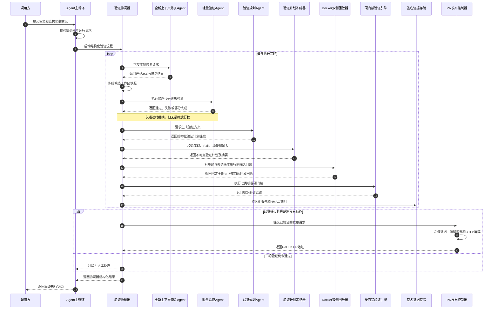

# Verification、可观测性与 PR 放行实现状态

审计基线：

- 当前 detached 工作树的 `HEAD`、`main`、`origin/main`、`main--verification` 均为
  `d17ea3c8143cb59a75517cc48a33e98e4c8904d9`；旧 `main-verification` 分支仍停在
  `5310e93bcc22`，本次没有切换或改写分支；
- 目标参照：《Loop Engineering 实战：实现从日志扫描到预发部署的全自主闭环》；
- 本文只描述源码能力与测试边界，不把 mock、synthetic evidence 或接口定义表述为真实环境验证。

## 结论

源码已经具备一条可达的 Coordinator 与机器门禁链路：

```text
submit() coordinated mode
  -> fresh Repair Agent
  -> fresh lightweight Verification Agent
  -> description-only generation Skill selection
  -> fresh Verification Planning Agent
  -> frozen VerificationPlan
  -> control/candidate Docker replay
  -> VerificationEngine seven gates
  -> signed report
  -> optional PR release
```

`VerificationCoordinator` 是该流程的编排状态所有者，默认最多执行三轮。每轮失败会把结构化失败交给
下一轮 Repair；达到上限后转 `ESCALATED`。只有机器报告为 `VERIFIED`，且报告、attestation、
ReleaseRequest 与冻结 Plan/Incident 完整绑定时，Coordinator 才会调用 release action。

这仍不能称为已经完成真实业务闭环。当前没有真实 CCB `buildx + registry`
运行与镜像健康检查、真实 Docker + OTLP + GitHub 联合 E2E、独立日志语义诊断、
UI 视觉证据、钉钉审批、持久任务队列
和崩溃后续跑。`submit()` 的 coordinated mode 也必须由调用方显式注入 Coordinator 与
`CoordinatorRunRequest`；未配置时仍走普通 Agent Loop，不能声称所有代码任务都被强制验证。

## 当前实际主链



### `submit()` 接入边界

- `AgentConfig.verification_coordinator` 与 `verification_run_request` 只要任一出现，就进入
  coordinated mode；两者必须同时有效，否则返回 `error_verification_setup`。
- coordinated mode 不先运行普通 Main Agent。Repair、Lightweight Verification、Planning
  分别由 `run_subagent(context_mode="fresh")` 启动，避免继承父消息历史和上一角色结论。
- `submit()` 输出包含 Coordinator outcome、`code_fix_verified` 和明确的
  `verification_escalated` / `verification_release_blocked` 错误 subtype。
- 当前没有从普通 CLI/配置文件自动构造整套 Coordinator 依赖的生产 bootstrap；调用方必须
  显式装配 policy、Skill loader、evidence providers、replay resolver、签名 store 和 release。

## 三个 fresh Agent 的职责

| 角色 | 工具/工作区 | 输出 | 权限边界 |
|---|---|---|---|
| Repair | cwd 为 candidate；Read/Glob/Grep/Edit/Write/Bash/Load_Skill | 严格 JSON handoff | workspace guard 阻止工具路径越界；不能冻结 Plan、签名或 release |
| Lightweight Verifier | candidate workspace；Read/Glob/Grep/Bash，叠加 verifier 权限规则 | 文本报告及唯一 `VERDICT` | `FAIL/PARTIAL` 可硬阻断本轮；`PASS` 不能放行 |
| Planning | control workspace；仅 Read/Glob/Grep | 严格 JSON `VerificationPlanProposal` | workspace guard 阻止读路径越界；只能提案 |

当 `VerificationPlanFreezer` 配置 `VerificationGenerationSkillCatalog` 时，Planning 前先运行一轮
无工具、全新上下文的生成 Skill 选择。该轮只看到 `name`、`description` 和每个场景的
`selection_prompt/when/exclusions`，看不到 `SKILL.md` body。选中后才加载完整 SOP 与本地加固
reference；Planner 必须回传 `generation_skill_names/choices/digests`，Freezer 会从受信根目录
重新加载、复核所选场景路由并绑定到 Plan digest。领域生成 Skill 统一放在
`skills/verification-generators/verification-*`；
它们指导测试方案生成，不替代最终执行用的 `verification.yaml` case pack。

生成 Skill 的逐项剩余缺口见
[`verification-generation-skill-gaps.md`](verification-generation-skill-gaps.md)。当前尚缺把
candidate-external 生成物自动转换、挂载并执行为冻结 case pack 的受信 adapter，因此这里不能
声称六套 SOP 已完成真实 generator-to-replay E2E。

Planning Agent 的输出有 1 MiB 上限、拒绝重复 JSON key、NaN/Infinity、Markdown 包装和非对象
顶层。`VerificationPlanFreezer` 随后重新校验：选中 Skill 必须在 allowlist；场景必须精确覆盖
Skill、UI 和 behavior policy；事故 reproducer 必须复用冻结原始输入与 failure signature，并要求
`control=failure -> candidate=success`；candidate、control、policy、Skill 和所有输入摘要进入
Plan digest。Agent 不能通过 JSON 提案降低这些约束。

Read/Edit/Write/Glob/Grep 的相对路径都按各自 `AgentState.cwd` 解析；
`build_workspace_guard` 还会解析绝对路径、`..` 和符号链接，对 Bash 显式路径 token
做同样越界阻断，再叠加角色命令策略与父权限。Repair/Lightweight 的 Bash 还会被替换为
`CommandRunner`：shell-free argv、一次性 candidate 副本、最小环境、禁网、锁定已有文件，
并在超时或正常退出后清理整个进程组；无法使用 macOS Seatbelt 时 fail-closed。该边界是
进程级 OS sandbox，不是 VM，且目前只有 macOS backend。

## Coordinator 与三轮状态机

已实现：

- `CoordinatorStateStore` 对单个 run 使用非阻塞文件锁，原子持久化 state；
- 每轮按 `REPAIR -> LIGHTWEIGHT_VERIFICATION -> PLAN_FROZEN -> REPLAY -> COMPLETE`
  记录 candidate 信息、Plan/replay 文件、report 位置和失败；
- Plan 与 replay receipt 写入后不可用不同内容覆盖；每个关键阶段复核 control、candidate 和
  Plan digest；
- 默认三轮且模型上限为三轮；也允许调用方设置更小的 `max_cycles`；
- 前一轮失败进入下一轮 Repair 的 `previous_failures`；达到上限后调用可选 escalation handler；
- `VERIFIED` 前不能调用 release；release 失败单独进入 `RELEASE_BLOCKED`，不会伪装成成功。

当前边界：state 是持久证据，不是崩溃恢复引擎。重复 `run_id` 会拒绝初始化，进程重启后尚无
从最后阶段续跑、任务 lease、幂等外部副作用补偿或分布式并发控制。

## Docker control/candidate replay

`DockerReplayLauncher` 已实现每个冻结场景的同输入双侧回放：

- 只接受 `name@sha256:<digest>` 镜像；`docker image inspect` 必须证明 RepoDigest、OCI revision
  和 workspace digest label 与 Plan 一致；control/candidate 镜像不能相同；
- 默认无网络，容器使用只读 root、launcher 的宿主 UID/GID（无该接口时回退 65534）、
  `cap-drop=ALL`、no-new-privileges、pids/memory/CPU/tmpfs/timeout 限制，并禁止 shell
  作为 entrypoint；launcher 若以 root 运行，当前不会额外拒绝；
- 规范化输入以只读文件挂载；run/cycle/scenario/variant/input/Plan/policy/Skill/source 身份通过
  环境变量注入；
- stdout、stderr、`result.json` 均有 4 MiB 硬上限；超时、输出超限、执行异常、结果 schema
  或绑定不一致都会记录不完整 execution window 并 fail-closed；
- 每次执行后强制 `docker rm -f` 并再次查询确认容器消失；无法确认清理也会阻断；
- control 必须复现冻结 failure signature，candidate 必须成功且不能继续携带该 signature；
  replay receipt 覆盖 Plan 中全部场景后才可能通过。
- 容器的 `result.json` 只允许给出 raw response/log 和关联字段，不能自报 outcome、failure
  signature 或 pass；`HostReplayOracle` 在宿主侧重算语义结果，只有 2xx 且无 ERROR/FATAL
  才是 success，failure signature 的全部条件必须命中同一条诊断；
- 每个 execution window 都要求 traces/logs 的 OTLP force-flush barrier。SQLite 记录 ingest
  watermark；在验证查询时，缺失、重复、超时或 watermark 后晚到均 fail-closed；receipt 同时
  绑定 host oracle digest/decision 和 barrier digest。ReleaseManager 会在首次 Git 写操作前、
  以及 GitHub PR API 调用紧邻前用只读 SQLite 事务重新核对完整窗口与 barrier。

镜像来源支持两种互斥模式：静态 control/candidate 契约，或动态
`ReplayVariantResolver.resolve(plan)`。已实现的 `DockerBuildReplayVariantResolver` 每轮会：

- 对可信 control workspace 和受限于 candidate root 的本轮 workspace 重算 digest，再复制到临时快照；
- 校验受信 Dockerfile digest，禁止 `.dockerignore` 改变 build context；
- 用 `docker buildx build --push --no-cache --network none` 分别构建，写入 source/workspace labels；
- 从 buildx metadata 取 manifest digest，按 digest pull 并再走 image inspect；
- 返回绑定本轮 Plan source ref/digest 的不可变 variant 契约，防止复用旧 candidate 镜像。

当前边界：构建 resolver、宿主 oracle 和 flush barrier 已有源码与 mock/synthetic 测试，但尚未
用真实 CCB Dockerfile、buildx builder、registry 和 OTLP exporter 完成 E2E，也没有镜像启动后的
独立健康检查。`raw_response/raw_logs/model/tool_calls` 仍由 candidate 容器提供；宿主只重算这些
原始输入的语义，尚未由 candidate 外的独立请求/观测 harness 采集。默认 `network=none` 与真实
OTLP 回传路径也尚未完成可运行装配。

## VerificationPlan、Report 与 Attestation 硬绑定

以下字段已贯穿 `VerificationPlan -> VerificationRunRequest -> VerificationReport ->
VerificationAttestation -> VerifiedReleaseRequest/ReleaseRequest`：

- `incident_id`、`incident_digest`；
- `plan_digest`；
- `replay_digest`；
- `replay_manifest`：逐 scenario/variant 绑定 `collection_id`、input、OTLP barrier、host
  oracle 与原始 result 摘要；
- 每个冻结场景的 `scenario_input_digests`；
- run/cycle、control/candidate ref 与 digest、policy digest、Skill digests。

Plan 还冻结每个场景的 assertion contract。回归、边界和副作用断言只能引用受信
`ScenarioSpec.steps[].id`，必须三类均有覆盖且能唯一映射到通过的机器命令证据；
`forbidden_changed_paths` 必须与受信 behavior policy 完全一致。Planning Agent 只能提案，不能用
自然语言伪造断言或通过删减 behavior 约束放宽门禁。`VerificationPolicy.required_skills_by_rule`
固定 `matched_rule -> required Skills`，漏选、替代或未映射规则均 fail-closed；断言类别由受信
Skill step 的 `assertion_categories` 固定，Freezer 与最终 Gate 都会重算。旧 Skill 未声明类别时，
保守地要求每个 step 同时覆盖三类，不允许 Planner 自由贴标签。fixture/case runner 的独立只读
执行仍属于下述 P0。

Trace、Log、Behavior Gate 不再从某一类证据反推“预期输入”，而是直接核对 Plan 的场景输入摘要：

- Trace 每个场景必须恰有一份 candidate observation，且 input digest 等于 Plan；
- Log 的 control/candidate collection window 必须精确覆盖全部场景并匹配 Plan；
- Behavior 两侧 observation、window 和 candidate Trace 都必须匹配该场景的 Plan digest。

SQLite provider 只接受 replay manifest 指定的窗口全集；缺少、额外或替换窗口，以及 collection、
input、oracle/result、实时 barrier digest 任一不一致都会阻断，不能在 replay 后换入另一组内部
自洽的 SQLite evidence。

Coordinator 在持久化前再次比较 Report 与 Plan。Attested store 把上述绑定和报告内容摘要纳入
HMAC；加载时同时比较调用方期望、attestation 和 report。ReleaseManager 只接受这些绑定均一致
且能从原始 evidence 重算为 `VERIFIED` 的报告。

## 七类机器 Gate

| Gate | 已实现 | 仍需真实配置/环境验证 |
|---|---|---|
| Lint | 冻结 argv、退出码 0、零 warning、完整输出摘要 | CCB 最终 lint 命令 |
| Unit | 冻结 argv、sandbox、超时和输出证据 | 证明配置确为真实全量套件 |
| Integration | 选定 domain Skill 的全部冻结场景 | 真实 CCB case pack/reproducer |
| Trace | 0 ERROR、实际 model、显式 fallback、token `<150000`、finished；要求 OTLP flush/watermark | CCB 的真实字段、exporter forceFlush 与网络装配 |
| Staging log | 完整双侧窗口；candidate 不得新增 ERROR 指纹 | 独立语义诊断和噪声策略 |
| Behavior | 同输入 outcome/payload/model/tool-call/finished 比较；宿主重算 outcome/signature | candidate 外独立采集 raw response/log 的 harness |
| UI | 执行冻结 UI 命令，或 policy 明确 N/A | DOM/console/network/screenshot 视觉证据 |

普通 Verification Agent 或 Lightweight Verifier 的文字 `PASS` 均不参与最终 verdict。只有七类
Gate 恰好各一份且全部通过（UI 可由受信 policy 明确 N/A），Report 才能是 `VERIFIED`。

## 对照文章 11 步

| 步骤 | 当前状态 | 准确边界 |
|---|---|---|
| 0 仓库/App 安全校验 | 已实现组件 | ReleaseManager 校验 registry/path/Git root/remote；尚无生产 bootstrap 自动装配 |
| 1 分支与提交 | 已实现组件 | VERIFIED 后才创建 `fix/` 分支和单次提交；未做真实 GitHub E2E |
| 2 MR/Reviewer | 已实现组件 | 可创建/恢复 PR、指定 Reviewer、存回执；测试使用 mock/local Git |
| 3 预发部署 | 部分实现 | Docker build resolver 与 replay launcher 已有；健康检查和真实 buildx/registry/CCB E2E 未完成 |
| 4 聚焦集成 | 已实现内核 | Planning + Freezer + domain Skill 场景；缺真实 CCB case pack |
| 5 Trace 指标 | 已实现内核 | flush/watermark 协议已实现；真实 CCB exporter/网络闭环未跑通 |
| 6 独立预发诊断 | 部分实现 | ERROR 指纹差集已有；独立语义诊断 Skill 未接 |
| 7 前后行为对比 | 已实现内核 | Docker 同输入和 host oracle 已有；原始响应仍来自 candidate，未真实跑 CCB |
| 8 结构化报告 | 已实现 | 原始 evidence、Plan/Incident/input 绑定、HMAC、加载重算 |
| 9 审批通知 | 未实现 | 无钉钉 Connector、审批暂停/恢复；只有 escalation handler 协议 |
| 10 状态汇总 | 部分实现 | 持久 state、cycle、outcome 和 submit result 已有；无运行状态 UI/任务平台 |

项目顺序与文章略有不同：远端分支和 PR 延后到所有硬 Gate 通过之后，减少未验证远端变更。
终点只允许 PR + Reviewer，不自动 merge，也不生产发布。

## Release 边界

`CoordinatorReleaseAction` 比较 Coordinator 的 VERIFIED run/cycle、Incident、Plan 和场景输入
摘要与 `ReleaseRequest`，再调用内置 `ReleaseManager`。ReleaseManager 重新加载受信报告，检查
HMAC、policy/Skill/Plan/Incident/input 绑定、当前 workspace digest、changed-files allowlist、
remote base、Git tree digest，并拒绝任何命中 `workspace_ignore`、因而未进入已验证摘要的发布文件；
最终只允许 `fix/` 分支、PR 和 Reviewer。

仍未完成真实 GitHub API E2E，也没有独立低权限签名/发布进程。当前 HMAC 与 GitHub token
仍可能位于同一宿主用户的进程环境，不能宣称已经实现操作系统级权限隔离。OTLP barrier
已经在发布前两次实时复核；最终一次复核与 GitHub API 调用之间仍存在很短的 TOCTOU 窗口。

## 未完成事项

P0：

1. 提供可信生产 bootstrap，从配置安全构造 Coordinator、providers、resolver、release，并只允许
   Coordinator 实际 replay 的 receipt 签发可发布 attestation；standalone CLI 已明确拒绝签发
   `VERIFIED`；
2. 在真实 CCB Dockerfile/buildx builder/registry 上验证每轮构建解析，并增加健康检查；
3. 用 candidate 外的受信 harness 采集原始请求响应/日志，并把 Verification Skill 的 case/test
   runner 与 candidate 仓库隔离，防止通过修改 adapter、测试或 wrapper 伪造证据；
4. 为 CCB 补齐显式 fallback/finished/稳定关联字段，接通 exporter forceFlush 与 Docker 网络，
   验证真实 OTLP 采集与 barrier 协议；
5. 建立真实 CCB domain Skill、生产 policy 和可证明的全量测试命令；
6. 完成 Docker + CCB OTLP + Verification + GitHub PR 联合 E2E。

P1：

7. 独立日志语义诊断 Skill；
8. TUI/UI 的 DOM、console、network、截图证据；
9. 钉钉审批、暂停/恢复及人工处理状态；
10. Cron/持久队列、去重、lease、崩溃恢复、预算熔断和证据保留策略；
11. 独立低权限签名与发布进程；
12. 将 SQLite evidence 升级为独立签名/append-only 存储；当前具备数据库写权限者仍可同时伪造
    window 与 barrier 行。

## 不能过度声称

| 不能说 | 当前准确说法 |
|---|---|
| 已完成文章中的真实全自主闭环 | 已完成源码级 Coordinator 主链和硬门禁；生产装配与真实跨系统 E2E 未完成 |
| 所有 `submit()` 都强制 verification | 只有显式配置 Coordinator/request 的 coordinated mode 强制；普通模式保持原行为 |
| 已完成真实预发/生产 A/B | 已实现 buildx 镜像 resolver 与 digest-pinned 双侧回放；尚无真实 registry/CCB E2E 和健康检查 |
| Planning/Verification Agent 可以放行 | Agent 只能提案或阻断；PlanFreezer、Engine、attestation 和 Coordinator 才控制 release |
| Trace 四项都有 CCB 原生可信证据 | 存储与 flush/watermark 门禁已具备；CCB 埋点和真实 exporter 闭环仍未验证 |
| 已安全自动发布生产 | 只到 PR/Reviewer；无自动 merge/生产部署，且真实 GitHub E2E 未执行 |

## 关键代码索引

| 能力 | 代码 |
|---|---|
| `submit()` coordinated mode | `core/agent_loop.py::_submit_with_verification_coordinator` |
| fresh Repair/Lightweight | `core/agents/verification_workflow.py` |
| fresh Planning | `core/agents/verification_planning.py` |
| Coordinator/state | `core/verification/coordinator.py` |
| Incident/Plan/Freezer | `core/verification/workflow.py` |
| Docker build/replay/resolver | `core/verification/replay.py::DockerBuildReplayVariantResolver`、`DockerReplayLauncher` |
| Host oracle/replay manifest | `core/verification/replay_oracle.py`、`core/verification/models.py::ReplayEvidenceManifest` |
| 七类 Gate | `core/verification/engine.py`、`core/verification/gates.py` |
| SQLite evidence | `core/observability/`、`core/verification/providers.py` |
| HMAC evidence | `core/verification/store.py` |
| PR release 与实时 barrier 复核 | `core/release/` |

## 验证证据边界

当前自动化测试覆盖 Coordinator 三轮/升级、fresh Agent 与隔离 Bash、Plan/断言冻结、host
oracle、静态与动态 replay 绑定、Docker 命令安全/超时/输出上限/容器清理、OTLP barrier、Gate
重算、attestation 和 release fail-closed。本轮 Verification/Observability/Release 专项为
`255 passed`；全仓为 `547 passed, 11 failed`。当前观察到的失败集中于 Skill prompt、
Bash 默认策略、builtin tool 数量、旧 QueryParams/submit 签名和消息 UUID 相等性；当前脏工作树
无法完成这 11 项的干净基线归因。其中 Docker 与 GitHub 主要通过 fake runner/mock/local Git 验证控制逻辑；OTLP 样本
主要为 synthetic。除非另有真实运行记录，不应把这些测试表述为真实 CCB、真实 Docker registry、
真实 GitHub 或生产环境验证。
